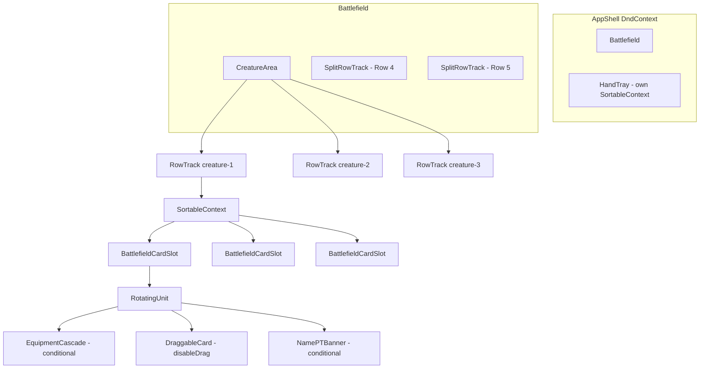
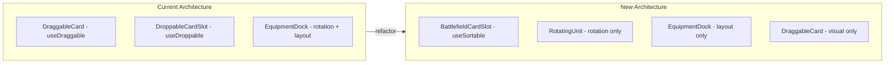
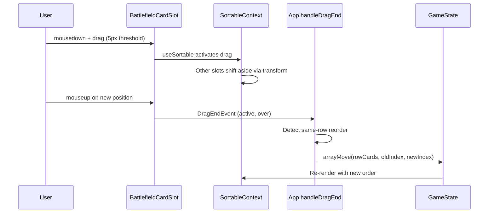
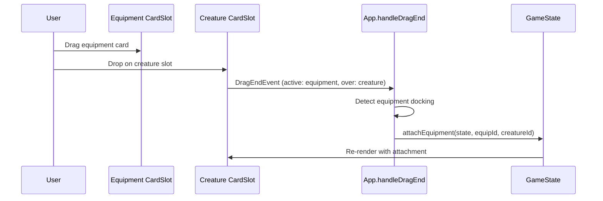
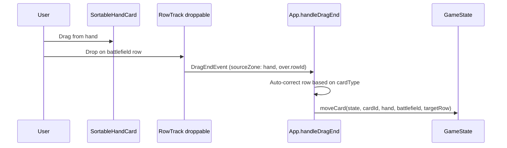

# Design Document: Battlefield Sortable + Unified Card Slot

## Overview

The battlefield currently has conflicting drag architectures that prevent drag-to-reorder within rows. `DraggableCard` owns `useDraggable` (card art is drag source), `DroppableCardSlot` owns `useDroppable` (outer div is drop target for equipment), and `@dnd-kit/sortable` cannot be layered on top because it conflicts with the inner `useDraggable`. Additionally, equipped and non-equipped creatures have completely different DOM structures, causing branching logic and inconsistent rotation behavior.

This design introduces a **Unified Card Slot** pattern where `BattlefieldCardSlot` uses `useSortable` as the single drag/drop/sort primitive. A `RotatingUnit` wrapper handles tap rotation for the entire card assembly (equipment cascade + card art + banners), eliminating the current split between `EquipmentDock` rotation and bare card rotation. `DraggableCard` gains a `disableDrag` prop so it becomes a pure visual component on the battlefield while retaining its own `useDraggable` in other zones.

## Architecture



### Before vs After



## Sequence Diagrams

### Drag-to-Reorder Within Row



### Equipment Docking via Drag



### Cross-Zone Move (Hand to Battlefield)



## Components and Interfaces

### Component 1: BattlefieldCardSlot

**Purpose**: Unified sortable wrapper for every battlefield card. Replaces both `DroppableCardSlot` and the bare `DraggableCard` usage on the battlefield.

**Interface**:
```typescript
interface BattlefieldCardSlotProps {
  el: RowCard;
  onTapCard: (cardId: string) => void;
  onCardHoverStart?: (cardId: string, zone: 'battlefield') => void;
  onCardHoverEnd?: (cardId: string) => void;
  onEquipmentAction?: (action: EquipmentAction) => void;
  style?: React.CSSProperties;
  isCompressed?: boolean;
}
```

**Responsibilities**:
- Call `useSortable` with `id: el.instanceId` and data payload `{ cardId, cardName, sourceZone, cardType, rowId }`
- Apply `transform` and `transition` from useSortable to the outer div (shift-aside animation)
- Set opacity to 0.3 when this card is the active drag item
- Render `RotatingUnit` as child containing all visual content
- Provide equipment drop target semantics via sortable data

### Component 2: RotatingUnit

**Purpose**: Wrapper that applies tap rotation to the entire card assembly as one unit.

**Interface**:
```typescript
interface RotatingUnitProps {
  isTapped: boolean;
  children: React.ReactNode;
}
```

**Responsibilities**:
- Apply `transform: rotate(90deg)` with `transition: transform 200ms ease` when `isTapped`
- Set `transformOrigin: center center`
- Contains: EquipmentCascade (conditional) + CardArt + CounterBadges + NamePTBanner

### Component 3: DraggableCard (modified)

**Purpose**: Card visual component that optionally participates in drag. On the battlefield, drag is disabled (handled by parent `BattlefieldCardSlot`). In hand/sidebar, drag remains active.

**Interface change**:
```typescript
interface DraggableCardProps {
  // ... existing props unchanged ...
  /** When true, disables useDraggable — card becomes pure visual */
  disableDrag?: boolean;
}
```

**Responsibilities**:
- When `disableDrag === true`: skip `useDraggable`, render as static visual with click/hover handlers
- When `disableDrag === false` (default): existing behavior unchanged
- Always renders: card image, token badge, phased overlay

### Component 4: EquipmentDock (simplified)

**Purpose**: Pure layout component rendering equipment cascade behind a creature. No longer handles rotation.

**Interface** (unchanged externally):
```typescript
interface EquipmentDockProps {
  creature: RowCard;
  attachments: RowCard[];
  effectiveStats: EffectiveStats;
  onAction: (action: EquipmentAction) => void;
  onTapCard?: (cardId: string) => void;
  onCardHoverStart?: (cardId: string, zone: 'battlefield') => void;
  onCardHoverEnd?: (cardId: string) => void;
}
```

**Changes**:
- Remove `transform: rotate(90deg)` from the root div (rotation now handled by `RotatingUnit`)
- Keep: cascade offset layout, sideways name labels, modified P/T overlay, Ctrl+click fan-out
- `DraggableCard` calls inside EquipmentDock get `disableDrag={true}`

### Component 5: RowTrack (in Battlefield.tsx)

**Purpose**: Horizontal row track that wraps children in `SortableContext` for drag-to-reorder.

**Changes**:
- Import `SortableContext` and `horizontalListSortingStrategy`
- Wrap card rendering in `<SortableContext items={ids} strategy={horizontalListSortingStrategy}>`
- Replace `DroppableCardSlot` with `BattlefieldCardSlot`
- Keep `useDroppable` for cross-zone drops (cards from hand landing on the row)
- Keep dynamic spacing/compression logic unchanged

## Data Models

### Sortable Data Payload

```typescript
/** Data attached to each sortable item for handleDragEnd routing */
interface SortableCardData {
  cardId: string;
  cardName: string;
  sourceZone: 'battlefield';
  cardType: CardType;
  rowId: RowTarget;
}
```

**Validation Rules**:
- `cardId` must be a valid UUID matching a `RowCard.instanceId` on the battlefield
- `sourceZone` is always `'battlefield'` for BattlefieldCardSlot items
- `cardType` determines equipment docking eligibility and row auto-correction
- `rowId` enables same-row vs cross-row detection in handleDragEnd

### RowCard (unchanged)

The existing `RowCard` interface remains the source of truth. No schema changes needed — the sortable layer is purely a UI concern that reads from `RowCard` and dispatches state updates via existing actions.

## Key Functions with Formal Specifications

### Function 1: handleSortableReorder

```typescript
function handleSortableReorder(
  state: GameState,
  cardId: string,
  overCardId: string,
  rowId: RowTarget
): GameState
```

**Preconditions:**
- `cardId` exists in the specified row's elements array
- `overCardId` exists in the same row's elements array
- `cardId !== overCardId`

**Postconditions:**
- Returns new GameState with the card moved to the position of `overCardId`
- Total card count in the row is unchanged
- All attachments on the moved card are preserved
- Cards not involved in the reorder maintain their relative positions
- No cards are duplicated or lost across the entire game state

**Loop Invariants:** N/A (uses `arrayMove` — single operation)

### Function 2: detectDragIntent

```typescript
function detectDragIntent(
  active: { data: { current: SortableCardData } },
  over: { id: string; data: { current: Record<string, unknown> } },
  gameState: GameState
): 'reorder' | 'equipment-dock' | 'cross-zone' | 'cross-row' | 'no-op'
```

**Preconditions:**
- `active` contains valid `cardId` and `sourceZone`
- `over` is non-null (drop landed on a valid target)

**Postconditions:**
- Returns exactly one intent category
- `'reorder'`: active and over are in the same row, both are sortable battlefield items
- `'equipment-dock'`: active is equipment/aura, over is a creature
- `'cross-zone'`: active.sourceZone !== 'battlefield' OR over is a non-battlefield zone
- `'cross-row'`: active is battlefield card, over is a different row
- `'no-op'`: active.id === over.id (dropped on self)

### Function 3: BattlefieldCardSlot component

```typescript
function BattlefieldCardSlot(props: BattlefieldCardSlotProps): JSX.Element
```

**Preconditions:**
- `props.el` is a valid `RowCard` with non-null `instanceId` and `card`
- Component is rendered inside a `SortableContext`

**Postconditions:**
- Renders exactly one sortable DOM node with `id === el.instanceId`
- When `el.attachments.length > 0`: renders EquipmentDock inside RotatingUnit
- When `el.attachments.length === 0`: renders DraggableCard directly inside RotatingUnit
- `DraggableCard` always receives `disableDrag={true}`
- Tap rotation is applied at the RotatingUnit level, not inside DraggableCard or EquipmentDock

## Algorithmic Pseudocode

### handleDragEnd Routing (updated)

```typescript
function handleDragEnd(event: DragEndEvent): void {
  const { active, over } = event;
  if (!over) return; // snap back

  const cardId = active.data.current?.cardId as string;
  const sourceZone = active.data.current?.sourceZone as Zone;
  const overData = over.data.current;

  // 1. Equipment docking: equipment/aura dropped on creature
  if (isEquipmentDocking(active, over, gameState)) {
    performEquipmentDock(cardId, overData.cardId);
    return;
  }

  // 2. Same-row reorder: both active and over are battlefield sortables in same row
  if (sourceZone === 'battlefield' && overData?.sourceZone === 'battlefield') {
    const activeRowId = active.data.current?.rowId as RowTarget;
    const overRowId = overData?.rowId as RowTarget;

    if (activeRowId === overRowId && cardId !== (over.id as string)) {
      setState(prev => {
        const rowCards = getRowCards(prev, activeRowId);
        const oldIndex = rowCards.findIndex(rc => rc.instanceId === cardId);
        const newIndex = rowCards.findIndex(rc => rc.instanceId === (over.id as string));
        if (oldIndex === -1 || newIndex === -1) return prev;
        const reordered = arrayMove(rowCards, oldIndex, newIndex);
        return setRowCards(prev, activeRowId, reordered);
      });
      return;
    }

    // Cross-row move on battlefield
    if (activeRowId !== overRowId) {
      setState(prev => moveCard(prev, cardId, 'battlefield', 'battlefield', overRowId));
      return;
    }
  }

  // 3. Hand reorder (existing, unchanged)
  // 4. Cross-zone moves (existing, unchanged)
}
```

### Helper: getRowCards / setRowCards

```typescript
function getRowCards(state: GameState, rowId: RowTarget): RowCard[] {
  if (rowId.startsWith('creature-')) {
    const idx = parseInt(rowId.replace('creature-', ''), 10) - 1;
    return state.creatureArea.rows[idx]?.elements ?? [];
  }
  if (rowId === 'row4-lands') return state.row4.left;
  if (rowId === 'row4-artifacts') return state.row4.right;
  if (rowId === 'row5-lands') return state.row5.left;
  if (rowId === 'row5-enchantments') return state.row5.right;
  return [];
}

function setRowCards(state: GameState, rowId: RowTarget, cards: RowCard[]): GameState {
  if (rowId.startsWith('creature-')) {
    const idx = parseInt(rowId.replace('creature-', ''), 10) - 1;
    const newRows = state.creatureArea.rows.map((r, i) =>
      i === idx ? { ...r, elements: cards } : r
    );
    return { ...state, creatureArea: { ...state.creatureArea, rows: newRows } };
  }
  if (rowId === 'row4-lands') return { ...state, row4: { ...state.row4, left: cards } };
  if (rowId === 'row4-artifacts') return { ...state, row4: { ...state.row4, right: cards } };
  if (rowId === 'row5-lands') return { ...state, row5: { ...state.row5, left: cards } };
  if (rowId === 'row5-enchantments') return { ...state, row5: { ...state.row5, right: cards } };
  return state;
}
```

## Example Usage

```typescript
// RowTrack with SortableContext
import { SortableContext, horizontalListSortingStrategy } from '@dnd-kit/sortable';

function RowTrack({ rowId, elements, onTapCard, onCardHoverStart, onCardHoverEnd, onEquipmentAction }: RowTrackProps) {
  const ids = elements.map(el => el.instanceId);
  const containerRef = useRef<HTMLDivElement>(null);
  const [negativeMargin, setNegativeMargin] = useState(0);
  const { setNodeRef, isOver } = useDroppable({ id: `row-${rowId}`, data: { rowId } });

  // ... dynamic spacing logic unchanged ...

  return (
    <div ref={combinedRef} className="flex-1 flex flex-row items-center ...">
      <SortableContext items={ids} strategy={horizontalListSortingStrategy}>
        {elements.map((el, idx) => (
          <BattlefieldCardSlot
            key={el.instanceId}
            el={el}
            onTapCard={onTapCard}
            onCardHoverStart={onCardHoverStart}
            onCardHoverEnd={onCardHoverEnd}
            onEquipmentAction={onEquipmentAction}
            style={idx > 0 && negativeMargin > 0 ? { marginLeft: `-${negativeMargin}px` } : undefined}
            isCompressed={negativeMargin > 0}
          />
        ))}
      </SortableContext>
    </div>
  );
}

// BattlefieldCardSlot
import { useSortable } from '@dnd-kit/sortable';
import { CSS } from '@dnd-kit/utilities';

function BattlefieldCardSlot({ el, onTapCard, onCardHoverStart, onCardHoverEnd, onEquipmentAction, style, isCompressed }: BattlefieldCardSlotProps) {
  const { attributes, listeners, setNodeRef, transform, transition, isDragging } = useSortable({
    id: el.instanceId,
    data: {
      cardId: el.instanceId,
      cardName: el.card.name,
      sourceZone: 'battlefield' as const,
      cardType: el.card.cardType,
      rowId: el.rowAssignment,
    },
  });

  const sortableStyle: React.CSSProperties = {
    transform: CSS.Transform.toString(transform),
    transition,
    opacity: isDragging ? 0.3 : 1,
    zIndex: isDragging ? 50 : undefined,
    ...style,
  };

  return (
    <div ref={setNodeRef} style={sortableStyle} {...attributes} {...listeners} className="flex-shrink-0">
      <RotatingUnit isTapped={el.isTapped}>
        {el.attachments.length > 0 ? (
          <EquipmentDock creature={el} attachments={attachmentRowCards} effectiveStats={effectiveStats} onAction={onEquipmentAction} onTapCard={onTapCard} onCardHoverStart={onCardHoverStart} onCardHoverEnd={onCardHoverEnd} />
        ) : (
          <DraggableCard card={el.card} sourceZone="battlefield" disableDrag={true} isTapped={false} isFaceDown={el.isFaceDown} showingBackFace={el.showingBackFace} onClick={onTapCard} onHoverStart={onCardHoverStart} onHoverEnd={onCardHoverEnd} />
        )}
        {/* Counter badges and name/PT banner rendered here */}
      </RotatingUnit>
    </div>
  );
}

// RotatingUnit
function RotatingUnit({ isTapped, children }: RotatingUnitProps) {
  return (
    <div
      style={{
        transform: isTapped ? 'rotate(90deg)' : undefined,
        transition: 'transform 200ms ease',
        transformOrigin: 'center center',
        width: '11.43vh',
        height: '16vh',
      }}
    >
      {children}
    </div>
  );
}

// DraggableCard with disableDrag
function DraggableCard({ card, sourceZone, disableDrag = false, isTapped, isFaceDown, showingBackFace, onClick, onHoverStart, onHoverEnd, className }: DraggableCardProps) {
  // Only use the drag hook when drag is enabled
  const { attributes, listeners, setNodeRef, transform, isDragging } = disableDrag
    ? { attributes: {}, listeners: undefined, setNodeRef: undefined, transform: null, isDragging: false }
    : useDraggable({ id: card.id, data: { cardId: card.id, cardName: card.name, sourceZone, cardType: card.cardType } });

  const displayImage = isFaceDown ? CARD_BACK_URL : showingBackFace && card.backFaceImageURI ? card.backFaceImageURI : card.imageURI;

  return (
    <div
      ref={disableDrag ? undefined : setNodeRef}
      {...(disableDrag ? {} : listeners)}
      {...(disableDrag ? {} : attributes)}
      className={`select-none touch-none ${disableDrag ? 'cursor-pointer' : 'cursor-grab'} overflow-hidden relative ${className}`}
      style={{ width: '11.43vh', height: '16vh', transform: transform ? CSS.Translate.toString(transform) : undefined }}
      onClick={() => { if (!isDragging) onClick?.(card.id); }}
      onMouseEnter={() => onHoverStart?.(card.id, sourceZone)}
      onMouseLeave={() => onHoverEnd?.(card.id)}
    >
      
      {card.isTokenCopy && <div className="absolute top-1 left-1 bg-black/70 text-white text-[9px] font-bold px-1 py-0.5 rounded pointer-events-none z-10">TOKEN</div>}
    </div>
  );
}
```

## Correctness Properties

### Property 1: Card Count Invariant

For any reorder operation within a row, the total number of cards across all zones in the game state must remain constant. No cards are created or destroyed by a reorder.

`∀ reorder(state, cardId, newIndex): countAllCards(before) === countAllCards(after)`

### Property 2: Attachment Preservation

When a card with attachments is reordered, all its attachments move with it. The attachment array is never modified by a reorder.

`∀ reorder(state, cardId, newIndex): card.attachments === reorderedCard.attachments`

### Property 3: Single Sortable Identity

Each battlefield card has exactly one sortable ID (`instanceId`). No two sortable items in the same `SortableContext` share an ID.

`∀ row: new Set(row.elements.map(e => e.instanceId)).size === row.elements.length`

### Property 4: Rotation Unity

When a card is tapped, the entire visual assembly (equipment cascade + card art + banners) rotates as one unit. There is no state where equipment rotates independently of its parent creature.

### Property 5: Drag Source Exclusivity

On the battlefield, only `BattlefieldCardSlot` (via `useSortable`) is a drag source. `DraggableCard` never activates its own `useDraggable` when rendered on the battlefield.

`∀ battlefieldCard: DraggableCard.disableDrag === true`

### Property 6: Hand Independence

Hand cards continue using their own `useSortable` in `HandTray`. The battlefield sortable refactor does not affect hand drag behavior.

## Error Handling

### Error Scenario 1: Drop Outside Valid Target

**Condition**: User releases drag over empty space (no `over` target)
**Response**: `handleDragEnd` returns early, DragOverlay snaps back via `dropAnimationConfig`
**Recovery**: No state change, card returns to original position

### Error Scenario 2: Reorder with Stale State

**Condition**: `arrayMove` receives indices that don't match current state (race condition with rapid drags)
**Response**: `findIndex` returns -1, early return with no state change
**Recovery**: Card snaps back, user can retry

### Error Scenario 3: Equipment Dock on Non-Creature

**Condition**: Equipment dropped on a non-creature sortable item
**Response**: `isEquipmentDocking` check fails, falls through to reorder/cross-zone logic
**Recovery**: Card is reordered or moved to appropriate row based on card type auto-correction

### Error Scenario 4: Sortable ID Collision

**Condition**: Two cards somehow get the same `instanceId` (should never happen with UUID generation)
**Response**: `@dnd-kit/sortable` may behave unpredictably with duplicate IDs
**Recovery**: Defensive check in `createRowCard` ensures UUID uniqueness; if detected, log warning and regenerate

## Testing Strategy

### Unit Testing Approach

- Test `BattlefieldCardSlot` renders correctly for cards with and without attachments
- Test `RotatingUnit` applies rotation transform when `isTapped={true}`
- Test `DraggableCard` with `disableDrag={true}` does not attach drag listeners
- Test `EquipmentDock` no longer applies rotation (pure layout verification)
- Test `handleDragEnd` routing: verify correct intent detection for reorder vs dock vs cross-zone

### Property-Based Testing Approach

**Property Test Library**: fast-check

Key properties to test:

1. **Card count invariant after reorder**: Generate arbitrary battlefield states and reorder operations. Assert total card count is unchanged.
2. **Attachment preservation after reorder**: Generate cards with random attachments, reorder them, verify attachments are identical.
3. **arrayMove idempotence**: `arrayMove(arr, i, i)` returns array unchanged.
4. **No duplicate IDs in SortableContext**: For any generated row state, all instanceIds are unique.

### Integration Testing Approach

- Simulate full drag-and-drop sequences using `@dnd-kit` test utilities
- Verify that reordering a card with equipment preserves the equipment visually
- Verify that hand sortable still works independently after battlefield changes
- Verify that cross-zone drag (hand to battlefield) still routes correctly

## Performance Considerations

- `useSortable` adds one `ResizeObserver` per sortable item. With 20+ creatures on battlefield, this is acceptable but should be monitored.
- `SortableContext` with `horizontalListSortingStrategy` uses O(n) position calculations during drag. For typical battlefield sizes (< 30 cards per row), this is negligible.
- The dynamic spacing `useEffect` recalculates on every element change. This is already the case and remains unchanged.
- `CSS.Transform.toString(transform)` is called per-frame during drag for shifting items. This is GPU-accelerated and does not cause layout thrashing.
- `DragOverlay` continues rendering the card image following the cursor — no change to overlay performance.

## Security Considerations

Not applicable — this is a client-side UI refactor with no network calls, authentication, or data persistence changes.

## Dependencies

- `@dnd-kit/core` (existing) — DndContext, sensors, collision detection
- `@dnd-kit/sortable` (existing) — `useSortable`, `SortableContext`, `horizontalListSortingStrategy`, `arrayMove`
- `@dnd-kit/utilities` (existing) — `CSS.Transform.toString`
- No new dependencies required. All sortable primitives are already installed and used by `HandTray`.
