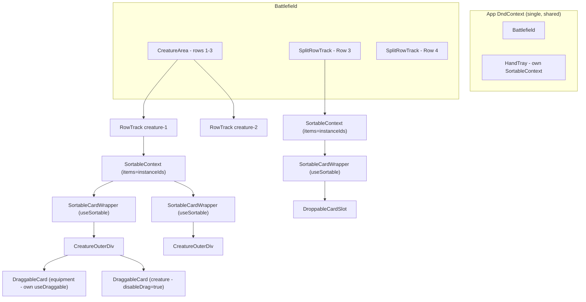
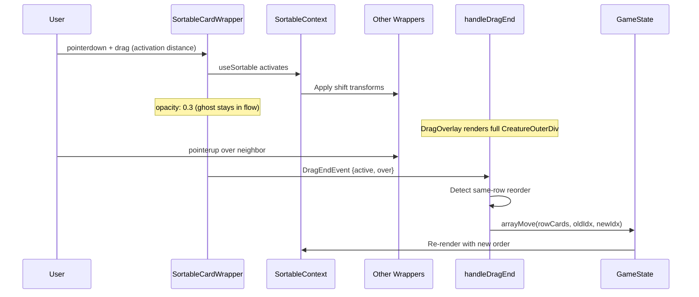

# Design Document: Battlefield Sortable

## Overview

This design adds drag-to-reorder within battlefield rows using `@dnd-kit/sortable`, enables equipment detach via drag, and preserves all existing interactions (tap, compression, cross-zone drag, equipment docking, fan-out).

The core challenge is layering `useSortable` onto existing components without breaking the current `useDraggable` (equipment cards inside a creature's cascade) or the `useDroppable` (equipment docking target on creatures). The solution uses a **sortable wrapper pattern** where `useSortable` owns the outer positioning, while inner DraggableCards for equipment retain their own independent `useDraggable`.

### Key Design Decisions

1. **Wrapper, not replacement**: Sortable is added as an outer wrapper around existing `CreatureOuterDiv`/`DroppableCardSlot`. The inner components stay mostly unchanged.
2. **Width-aware wrappers**: The sortable wrapper's width varies with tap state so `horizontalListSortingStrategy` computes correct shift offsets.
3. **DragOverlay for equipped creatures**: During drag, the sortable ghost (opacity 0.3) stays in-flow while `DragOverlay` renders the full `CreatureOuterDiv` (cascade + card + overlays) following the cursor.
4. **Equipment stays independently draggable**: Equipment `DraggableCard` instances inside the cascade keep their own `useDraggable`. The sortable wrapper does NOT swallow pointer events on equipment cards.
5. **Priority routing in handleDragEnd**: Routing checks happen in priority order: attached-equipment-drag → equipment-docking → same-row-reorder → cross-row-move → cross-zone-move.

## Architecture



### Sortable Wrapper Pattern

The key architectural pattern is a thin `SortableCardWrapper` component that:
1. Calls `useSortable` with the card's `instanceId`
2. Applies `CSS.Transform.toString(transform)` + `transition` to position the element during drag
3. Sets dynamic width based on tap state and attachment count
4. Passes through all props to the inner component (CreatureOuterDiv or DroppableCardSlot)
5. Does NOT capture pointer events on children — equipment DraggableCards bubble up naturally



## Components and Interfaces

### Component 1: SortableCardWrapper

**Purpose**: Thin wrapper that makes any battlefield card sortable without modifying its internals.

```typescript
interface SortableCardWrapperProps {
  id: string;           // instanceId — sortable key
  cardName: string;
  cardType: CardType;
  rowId: RowTarget;
  isTapped: boolean;
  attachmentCount: number;
  children: React.ReactNode;
  style?: React.CSSProperties;  // compression margins passed through
  className?: string;
}
```

**Implementation details**:
- Calls `useSortable({ id, data: { cardId: id, cardName, sourceZone: 'battlefield', cardType, rowId } })`
- Outer div applies `transform: CSS.Transform.toString(transform)`, `transition`, `opacity: isDragging ? 0.3 : 1`
- Width: `isTapped ? '16vh' : \`${11.43 + attachmentCount * 2}vh\``
- Height: always `16vh`
- `flex-shrink: 0` to work within flex row
- Merges `{...attributes}` and `{...listeners}` onto the outer div
- The outer div has `ref={setNodeRef}` for sortable measurement
- Additional `style` prop is spread (compression margins go here)

### Component 2: CreatureOuterDiv (minimal changes)

**Current role**: Renders creature cascade, rotation, overlays, fan-out. Uses `useDroppable` for equipment docking.

**Changes for sortable**:
- Equipment `DraggableCard` instances keep `disableDrag={false}` (independently draggable) — no change needed
- Equipment card wrappers already have `onPointerDown={(e) => e.stopPropagation()}` — this prevents sortable from capturing equipment drags
- The main creature `DraggableCard` keeps `disableDrag={true}` — no change needed
- No rotation changes needed — CreatureOuterDiv already handles its own rotation via `outerStyle.transform`

**Key insight**: CreatureOuterDiv is rendered INSIDE the `SortableCardWrapper`. The sortable wrapper handles positioning/shift-aside. CreatureOuterDiv handles rotation/visuals internally. They compose cleanly.

### Component 3: DroppableCardSlot (minimal changes)

**Current role**: Renders land/artifact/enchantment cards in SplitRowTrack with `useDroppable`.

**Changes for sortable**:
- Wrapped by `SortableCardWrapper` at the SplitRowTrack level (not internally modified)
- Internal `useDroppable` remains for equipment docking
- No width changes needed internally — width is controlled by the outer wrapper

### Component 4: RowTrack (in Battlefield.tsx, modified)

**Changes**:
- Import `SortableContext`, `horizontalListSortingStrategy`
- Wrap element rendering in `<SortableContext items={ids} strategy={horizontalListSortingStrategy}>`
- Replace bare `CreatureOuterDiv` with `SortableCardWrapper > CreatureOuterDiv`
- Keep existing `useDroppable` on the row container for cross-zone drops
- Keep compression logic — negative margins applied to `SortableCardWrapper` via `style` prop

```typescript
// Conceptual structure
<div ref={combinedRef} className="flex-1 flex flex-row items-center ...">
  <SortableContext items={ids} strategy={horizontalListSortingStrategy}>
    {elements.map((el, idx) => (
      <SortableCardWrapper
        key={el.instanceId}
        id={el.instanceId}
        cardName={el.card.name}
        cardType={el.card.cardType}
        rowId={rowId}
        isTapped={el.isTapped}
        attachmentCount={el.attachments.length}
        style={idx > 0 && negativeMargin > 0 ? { marginLeft: `-${negativeMargin}px` } : undefined}
      >
        <CreatureOuterDiv
          creature={el}
          onTapCard={onTapCard}
          isCompressed={negativeMargin > 0}
          {...otherProps}
        />
      </SortableCardWrapper>
    ))}
  </SortableContext>
</div>
```

### Component 5: SplitRowTrack (modified)

**Changes**:
- Each side (left/right) gets its own `SortableContext` with that side's `instanceId` array
- Each `DroppableCardSlot` is wrapped in `SortableCardWrapper`
- Same-name land overlap (negative margin for basics) is applied to the wrapper, not inside the slot

### Component 6: DragOverlay Rendering (in App.tsx, enhanced)

**Current**: Renders a simple card image during drag.

**Enhancement**:
- When `activeDragId` matches a battlefield card with attachments → render full `CreatureOuterDiv` in DragOverlay
- When dragging an attached equipment → render just the equipment card image
- When dragging an unequipped card → render simple card image (existing behavior)

```typescript
function renderDragOverlay(): React.ReactNode {
  if (!activeDragId) return null;

  // Check if it's a battlefield creature with attachments
  const bfCard = findCardOnBattlefield(gameState, activeDragId);
  if (bfCard && bfCard.card.attachments.length > 0) {
    return (
      <CreatureOuterDiv
        creature={bfCard.card}
        isCompressed={false}
        onTapCard={() => {}}
        style={{ opacity: 1, pointerEvents: 'none' }}
      />
    );
  }

  // Check if it's an attached equipment
  if (isAttachedEquipment(activeDragId, gameState)) {
    // Find the attachment card data
    const allBf = [...gameState.creatureArea.rows.flatMap(r => r.elements),
                   ...gameState.row3.left, ...gameState.row3.right,
                   ...gameState.row4.left, ...gameState.row4.right];
    for (const rc of allBf) {
      const att = rc.attachments.find(a => a.instanceId === activeDragId);
      if (att) {
        return ;
      }
    }
  }

  // Default: simple card image
  const card = findCardAnywhere(activeDragId, gameState);
  if (card) {
    return ;
  }
  return null;
}
```

## Data Models

### Sortable Data Payload

```typescript
/** Data attached to each sortable item for handleDragEnd routing */
interface SortableCardData {
  cardId: string;         // instanceId
  cardName: string;       // card.name
  sourceZone: 'battlefield';
  cardType: CardType;     // creature, land, artifact, etc.
  rowId: RowTarget;       // which row this card is in
}
```

### Width Calculation for Sortable Wrapper

```typescript
/** Sortable wrapper width in vh units.
 * Tapped cards rotate 90° — their horizontal footprint becomes the card height (16vh).
 * Untapped cards: base card width + cascade offset per attachment.
 */
function sortableWrapperWidthVh(isTapped: boolean, attachmentCount: number): number {
  return isTapped ? 16 : (11.43 + attachmentCount * 2);
}
```

This differs from `computeOuterDivWidthVh` because:
- When tapped, the card rotates 90° inside the wrapper, so the wrapper must be wide enough to contain the rotated card (= card height = 16vh)
- The sortable strategy needs the actual horizontal footprint for shift calculations

### handleDragEnd Routing Priority

```
Priority order (first match wins):
1. Attached equipment drag → detach routing (re-equip, detach-to-row, detach-to-zone)
2. Equipment/aura docking → attach to creature
3. Same-row reorder → arrayMove
4. Cross-row battlefield move → remove from source row, insert in target row
5. Cross-zone move → moveCard between zones
6. No target (over === null) → snap back, no-op
```

### RowCard (unchanged)

The existing `RowCard` interface remains the source of truth. No schema changes needed — the sortable layer is purely a UI concern that reads from `RowCard` and dispatches state updates via existing `getRowCards`/`setRowCards`/`arrayMove`.

## Key Algorithms

### handleDragEnd Updated Routing

```typescript
function handleDragEnd(event: DragEndEvent): void {
  setActiveDragId(null);
  const { active, over } = event;
  if (!over) return; // Rule 4.7: snap back

  const cardId = active.data.current?.cardId as string;
  const sourceZone = active.data.current?.sourceZone as Zone;
  if (!cardId || !sourceZone) return;

  const overId = over.id as string;
  const overData = over.data.current;

  // ── Priority 1: Attached equipment being dragged ──
  if (isAttachedEquipment(cardId, gameState)) {
    const parentId = findParentCreature(cardId, gameState)!;
    
    // 1a: Drop on different creature → re-equip
    if (overId.startsWith('card-drop-') && overData?.cardType === 'creature') {
      const targetId = overData.cardId as string;
      if (targetId !== parentId) {
        setState(prev => reattachEquipment(prev, cardId, parentId, targetId));
      }
      return;
    }
    // 1b: Drop on battlefield row → detach to standalone
    if (overId.startsWith('row-') || overData?.rowId) {
      setState(prev => detachEquipment(prev, cardId, parentId));
      return;
    }
    // 1c: Drop on hand/graveyard/exile/etc → detach + move to zone
    if (['hand-zone', 'hand-drop-zone'].includes(overId)) {
      setState(prev => {
        const d = detachEquipment(prev, cardId, parentId);
        return moveCard(d, cardId, 'battlefield', 'hand');
      });
      return;
    }
    if (['graveyard', 'exile', 'commandZone', 'library'].includes(overId)) {
      setState(prev => {
        const d = detachEquipment(prev, cardId, parentId);
        return moveCard(d, cardId, 'battlefield', overId as Zone);
      });
      return;
    }
    return; // No valid target → snap back
  }

  // ── Priority 2: Equipment docking (unattached eq → creature) ──
  if (overId.startsWith('card-drop-') && overData?.cardType === 'creature') {
    // ... existing equipment docking logic (unchanged) ...
  }

  // ── Priority 3: Same-row reorder ──
  if (sourceZone === 'battlefield' && overData?.sourceZone === 'battlefield') {
    const activeRowId = active.data.current?.rowId as RowTarget;
    const overRowId = overData?.rowId as RowTarget;

    if (activeRowId === overRowId && cardId !== overId) {
      setState(prev => {
        const rowCards = getRowCards(prev, activeRowId);
        const oldIndex = rowCards.findIndex(rc => rc.instanceId === cardId);
        const newIndex = rowCards.findIndex(rc => rc.instanceId === overId);
        if (oldIndex === -1 || newIndex === -1) return prev; // Rule 4.8: invalid index guard
        return setRowCards(prev, activeRowId, arrayMove(rowCards, oldIndex, newIndex));
      });
      return;
    }

    // ── Priority 4: Cross-row move ──
    if (activeRowId !== overRowId) {
      setState(prev => {
        const sourceCards = getRowCards(prev, activeRowId);
        const cardIndex = sourceCards.findIndex(rc => rc.instanceId === cardId);
        if (cardIndex === -1) return prev;
        const card = sourceCards[cardIndex];
        const newSource = sourceCards.filter(rc => rc.instanceId !== cardId);
        const targetCards = getRowCards(prev, overRowId);
        const insertAt = targetCards.findIndex(rc => rc.instanceId === overId);
        const newTarget = [...targetCards];
        newTarget.splice(
          insertAt === -1 ? newTarget.length : insertAt,
          0,
          { ...card, rowAssignment: overRowId }
        );
        let state = setRowCards(prev, activeRowId, newSource);
        state = setRowCards(state, overRowId, newTarget);
        return state;
      });
      return;
    }
  }

  // ── Priority 5: Cross-zone moves (existing logic, unchanged) ──
  // Hand reorder, hand→battlefield, battlefield→zone, zone→zone
}
```

### Equipment Drag Isolation

The key to equipment drag isolation is **event propagation control**:

```typescript
// Inside CreatureOuterDiv, each equipment card already has:
<div
  onPointerDown={(e) => e.stopPropagation()} // Prevents sortable from capturing
  onClick={(e) => e.stopPropagation()}        // Prevents tap toggle on parent
>
  <DraggableCard
    card={attachment.card}
    sourceZone="battlefield"
    disableDrag={false}  // Equipment keeps its own useDraggable
  />
</div>
```

When the user pointerdowns on an equipment card:
1. `stopPropagation()` prevents the event from reaching `SortableCardWrapper`'s listeners
2. `DraggableCard`'s own `useDraggable` activates independently
3. The sortable layer is unaware of this drag — no shift-aside happens for parent creature
4. `handleDragEnd` detects the card is attached equipment (Priority 1) and routes accordingly

### Compression + Sortable Transform Interaction

Compression uses negative `marginLeft` on each `SortableCardWrapper` to overlap cards visually. Sortable uses `CSS.Transform.toString(transform)` which generates `translate3d(x, y, 0)`. These are independent:

- **Negative margin**: affects layout flow (where the element "starts" in the flex container)
- **Transform translate**: offsets the element visually from its layout position (GPU layer)

During drag, `horizontalListSortingStrategy` measures actual element rects (which include margin effects) and computes transforms to shift neighbors into their new positions. The negative margins remain constant — they set the baseline. Transforms animate on top.

**Important**: The wrapper's explicit `width` style ensures `horizontalListSortingStrategy` knows the correct horizontal footprint even when compression is active. Without explicit width, the strategy would measure the visual width (which is reduced by overlap) and compute incorrect shift amounts.

## Correctness Properties

*A property is a characteristic or behavior that should hold true across all valid executions of a system — essentially, a formal statement about what the system should do. Properties serve as the bridge between human-readable specifications and machine-verifiable correctness guarantees.*

### Property 1: Card Count Invariant

*For any* game state and any drag operation (reorder, cross-row move, equipment detach, equipment re-equip), the total number of unique card instances across all zones SHALL remain constant before and after the operation.

**Validates: Requirements 5.1, 5.3, 5.4**

### Property 2: No Duplicate Instance IDs

*For any* game state after any drag operation, collecting all `instanceId` values across all battlefield rows, all attachment arrays, hand, graveyard, exile, library, and command zone SHALL produce a set with no duplicates.

**Validates: Requirements 5.2, 5.5**

### Property 3: Attachment Preservation During Reorder

*For any* same-row reorder operation on a card with N attachments, the card's `attachments` array SHALL be deeply equal before and after reorder, AND all other cards in the row SHALL have unchanged `attachments` arrays.

**Validates: Requirements 6.1, 6.2, 6.3**

### Property 4: Equipment Detach Placement

*For any* attached equipment dragged to a valid target (row, hand, graveyard, exile), the equipment SHALL appear exactly once in the target location AND zero times in the source creature's attachments after the operation completes.

**Validates: Requirements 3.2, 3.3, 5.5**

### Property 5: Equipment Re-equip Atomicity

*For any* attached equipment dragged from creature A to creature B (where A ≠ B), the equipment SHALL appear in creature B's attachments and NOT in creature A's attachments, with no intermediate state where the equipment exists in neither or both.

**Validates: Requirements 3.4**

### Property 6: Null Drop Is No-Op

*For any* game state and any active drag, if `handleDragEnd` receives `over === null`, the resulting state SHALL be reference-equal to the input state (no mutation).

**Validates: Requirements 3.5, 4.7**

### Property 7: Hand Independence

*For any* battlefield reorder or equipment operation, the `hand` array in the game state SHALL be reference-equal before and after the operation.

**Validates: Requirements 7.2**

### Property 8: Sortable Wrapper Width Formula

*For any* `(isTapped: boolean, attachmentCount: number >= 0)` pair, the sortable wrapper width SHALL equal `16` vh when tapped, and `11.43 + attachmentCount * 2` vh when untapped.

**Validates: Requirements 1.5**

## Error Handling

### Error 1: Drop Outside Valid Target

**Condition**: User releases drag over empty space (`over === null`).
**Response**: `handleDragEnd` returns early. DragOverlay snaps back via `dropAnimationConfig` (250ms cubic-bezier ease).
**Impact**: No state change. Card returns to original position visually.

### Error 2: Stale Index (findIndex returns -1)

**Condition**: Rapid state changes during drag cause `findIndex` to not find the card in the expected row.
**Response**: Early return with no state change (Rule 4.8).
**Impact**: Card snaps back. User can retry the drag.

### Error 3: Equipment Dropped on Non-Creature

**Condition**: Equipment card dropped on a land/artifact/enchantment sortable item.
**Response**: Equipment docking check fails (`overData.cardType !== 'creature'`). Falls through to reorder/cross-row logic. Equipment is placed as standalone in that row.
**Impact**: Graceful fallback — equipment becomes standalone card. User can re-dock via drag later.

### Error 4: Duplicate instanceId (defensive)

**Condition**: Should never occur (UUID v4 collision probability ~2^-122).
**Response**: If detected during render, `SortableContext` may show unpredictable behavior.
**Prevention**: `createRowCard` always generates fresh UUIDs via `crypto.randomUUID()`.

### Error 5: Compression Recalculation During Drag

**Condition**: Container resize triggers compression recalculation while a card is actively being dragged.
**Response**: Sortable transforms may briefly jump as baseline positions change mid-drag.
**Mitigation**: Acceptable UX — positions self-correct on drop. Future optimization: freeze compression during active drag via `useDndContext().active` check.

## Testing Strategy

### Property-Based Testing

**Library**: fast-check (already available in the project via devDependencies)

**Configuration**: Minimum 100 iterations per property test.

**Tag format**: `Feature: battlefield-sortable, Property {N}: {title}`

**Properties to implement**:

1. **Card count invariant** — Generate random GameState with random battlefield cards and attachments. Perform random reorder/detach/re-equip operations via `arrayMove`/`detachEquipment`/`reattachEquipment`. Assert total card count unchanged.

2. **No duplicate IDs** — Generate random GameState, perform random drag operation. Collect all instanceIds from all zones, assert `new Set(ids).size === ids.length`.

3. **Attachment preservation** — Generate rows with multiple equipped creatures (random attachment counts 0-4). Perform `arrayMove` reorder. Deep-compare all attachment arrays before/after.

4. **Equipment detach placement** — Generate state with 1+ equipped creature. Detach random equipment to random valid target. Assert exactly 1 occurrence in target, 0 in source attachments.

5. **Re-equip atomicity** — Generate state with 2+ creatures (at least one equipped). Call `reattachEquipment`. Assert equipment in target's attachments, not in source's.

6. **Null drop no-op** — Generate random state. Simulate handleDragEnd with `over=null`. Assert state reference-equal.

7. **Hand independence** — Generate state with hand cards. Perform battlefield `arrayMove`. Assert `state.hand` reference equality.

8. **Wrapper width formula** — Generate random `(boolean, number)` pairs. Assert `sortableWrapperWidthVh(tapped, N)` matches expected formula.

### Unit Tests (Example-Based)

- `SortableCardWrapper` renders with correct width for tapped card (16vh) and untapped with 2 attachments (15.43vh)
- `CreatureOuterDiv` equipment cards have `stopPropagation` on `onPointerDown`
- `DroppableCardSlot` inside `SortableCardWrapper` still responds to equipment drops
- Click on sortable-wrapped card toggles tap state (not consumed by sortable)
- `DragOverlay` renders full `CreatureOuterDiv` when active card has attachments
- `DragOverlay` renders simple card image for unequipped active card
- Compression negative margins applied to `SortableCardWrapper` style prop
- Alt+click fan-out works through sortable wrapper (event not captured by sortable)
- `handleDragEnd` detects same-row reorder (same rowId, different instanceId)
- `handleDragEnd` detects cross-row move (different rowId, both battlefield)
- `handleDragEnd` returns early when `findIndex` returns -1 (invalid index guard)

### Integration Tests

- Full drag sequence: reorder two creatures in same row, verify final element order
- Equipment detach: drag equipment off creature to hand zone, verify detach + zone move
- Hand drag to battlefield: card lands in correct row (auto-assignment unaffected by sortable)
- Hand reorder: hand sortable works independently of battlefield sortable
- Cross-row move: drag creature from row 1 to row 2, verify placement
