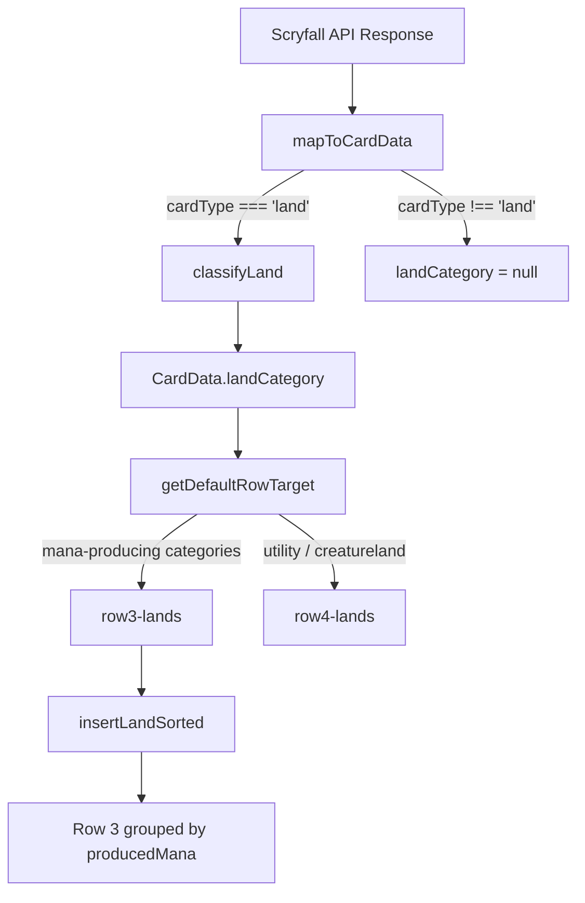

# Design Document: Land Categorization

## Overview

This feature adds a `landCategory` field to `CardData` that classifies every land into one of 26 recognized categories (24 Scryfall `is:` archetypes + `utility` + `unknown`). Classification is performed at import time by the existing pure function `classifyLand` in `src/api/landCategorizer.ts`. The result is stored on `CardData` and consumed by the battlefield layout engine to sort row 3 lands by mana-color group.

The feature touches four files:
1. **`src/types.ts`** — Add `landCategory: LandCategory | null` to `CardData`
2. **`src/api/mapToCardData.ts`** — Call `classifyLand` during card mapping
3. **`src/gameActions.ts`** — Replace the inline mana-only heuristic in `getDefaultRowTarget` with a `landCategory`-based check
4. **`src/persistence.ts`** — Tolerate missing `landCategory` on deserialized state

A new sort function inserts lands into row 3 grouped by `producedMana`, with rainbow lands at one end.

## Architecture



**Data flow:**
1. `mapToCardData` resolves `cardType`. If `'land'`, calls `classifyLand(oracleText, typeLine, producedMana, name)`.
2. `getDefaultRowTarget` reads `landCategory` to decide row3 vs row4.
3. `addToBattlefield` (via a new `insertLandSorted` helper) places row3 lands in sorted position by color group.

## Components and Interfaces

### classifyLand (existing — no changes needed)

```typescript
// src/api/landCategorizer.ts — already implemented
export function classifyLand(
  oracleText: string,
  typeLine: string,
  producedMana: string[],
  name: string
): LandCategory;
```

Pure function. 24 ordered pattern-match rules, fallback to `'utility'`, guard for missing data → `'unknown'`.

### CardData extension

```typescript
// src/types.ts — add import and field
import type { LandCategory } from './api/landCategorizer';

export interface CardData {
  // ... existing fields ...
  landCategory: LandCategory | null;
}
```

### mapToCardData integration

```typescript
// src/api/mapToCardData.ts
import { classifyLand } from './landCategorizer';

export function mapToCardData(raw: ScryfallCard, isCommander = false): CardData {
  const cardType = deriveCardType(frontFaceTypeLine);
  const landCategory = cardType === 'land'
    ? classifyLand(oracleText, typeLine, producedMana, name)
    : null;

  return { ...existingFields, landCategory };
}
```

### getDefaultRowTarget update

```typescript
// src/gameActions.ts — land case rewritten
case 'land': {
  if (!card.landCategory || card.landCategory === 'unknown') return 'row3-lands';
  // Utility lands and creature-lands go to row4
  if (card.landCategory === 'utility' || card.landCategory === 'creatureland') {
    return 'row4-lands';
  }
  return 'row3-lands';
}
```

This replaces the current inline oracle-text parsing with a single field check.

### insertLandSorted (new helper)

```typescript
// src/gameActions.ts — new function
function insertLandSorted(state: GameState, rowCard: RowCard): GameState {
  const lands = state.row3.left;
  const key = getManaGroupKey(rowCard.card.producedMana);
  const insertIdx = findColorGroupInsertionIndex(lands, key);
  const newLands = [...lands.slice(0, insertIdx), rowCard, ...lands.slice(insertIdx)];
  return { ...state, row3: { ...state.row3, left: newLands } };
}
```

### getManaGroupKey (new helper)

```typescript
/**
 * Produces a stable sort key from a producedMana array.
 * Colors are sorted alphabetically and joined: ["W","B"] → "B,W"
 * 5-color / "any color" → "rainbow"
 */
export function getManaGroupKey(producedMana: string[]): string {
  const colors = producedMana.filter(c => 'WUBRG'.includes(c));
  if (colors.length >= 5) return 'rainbow';
  return [...colors].sort().join(',');
}
```

### findColorGroupInsertionIndex (new helper)

```typescript
/**
 * Finds the correct insertion index for a land with the given group key.
 * Rainbow lands go at the end (rightmost group in row 3).
 * Other groups maintain stable ordering: first occurrence defines group position.
 */
export function findColorGroupInsertionIndex(lands: RowCard[], key: string): number {
  if (key === 'rainbow') return lands.length; // always append at end

  // Find last card in the same group
  let lastSameGroup = -1;
  for (let i = 0; i < lands.length; i++) {
    const k = getManaGroupKey(lands[i].card.producedMana);
    if (k === 'rainbow') break; // stop before rainbow section
    if (k === key) lastSameGroup = i;
  }

  if (lastSameGroup >= 0) return lastSameGroup + 1; // insert after last in group

  // New group — insert before rainbow section
  const rainbowStart = lands.findIndex(
    rc => getManaGroupKey(rc.card.producedMana) === 'rainbow'
  );
  return rainbowStart >= 0 ? rainbowStart : lands.length;
}
```

### Persistence backward compatibility

The existing `isValidSerializedGameState` does not check individual CardData fields, so old saves without `landCategory` will pass validation. A patch function is applied during deserialization to default the field:

```typescript
// src/persistence.ts — applied to all CardData in deserialized state
function patchCardData(card: any): CardData {
  return { ...card, landCategory: card.landCategory ?? null };
}
```

Applied recursively to all CardData in hand, library, graveyard, exile, commandZone, and all RowCards/attachments on battlefield.

## Data Models

### LandCategory (existing, 26 literals)

```typescript
export type LandCategory =
  | 'basic' | 'dual' | 'shockland' | 'fetchland' | 'checkland'
  | 'tangoland' | 'fastland' | 'slowland' | 'bondland' | 'painland'
  | 'filterland' | 'bounceland' | 'canopyland' | 'shadowland' | 'scryland'
  | 'gainland' | 'surveilland' | 'storageland' | 'bikeland' | 'tricycleland'
  | 'triland' | 'creatureland' | 'pathway' | 'rainbow' | 'utility' | 'unknown';
```

### Mana Group Key

A derived sort key for battlefield grouping:

| producedMana | Group Key |
|---|---|
| `["W"]` | `"W"` |
| `["W", "B"]` | `"B,W"` |
| `["G", "U", "W"]` | `"G,U,W"` |
| `["W","U","B","R","G"]` | `"rainbow"` |
| `[]` (colorless) | `""` |

### Row assignment decision table

| landCategory | Row Target |
|---|---|
| `null` / `"unknown"` | `row3-lands` |
| `"utility"` | `row4-lands` |
| `"creatureland"` | `row4-lands` |
| All other categories | `row3-lands` |

## Correctness Properties

*A property is a characteristic or behavior that should hold true across all valid executions of a system — essentially, a formal statement about what the system should do. Properties serve as the bridge between human-readable specifications and machine-verifiable correctness guarantees.*

### Property 1: Output validity

*For any* combination of oracle text, type line, produced mana array, and card name, `classifyLand` SHALL return a value that is one of the 26 defined `LandCategory` string literals.

**Validates: Requirements 1.1**

### Property 2: Non-land nullity

*For any* card where `cardType` is not `"land"` (including DFCs whose front face is non-land but back face is land), `mapToCardData` SHALL set `landCategory` to `null`.

**Validates: Requirements 2.2, 2.4**

### Property 3: Land classification consistency

*For any* land card, the `landCategory` field set by `mapToCardData` SHALL equal the value returned by calling `classifyLand(oracleText, typeLine, producedMana, name)` with that card's data.

**Validates: Requirements 2.3**

### Property 4: Priority ordering (first match wins)

*For any* land card whose oracle text and type line match multiple classification rules, `classifyLand` SHALL return the category corresponding to the lowest-numbered (highest priority) matching rule.

**Validates: Requirements 3.26**

### Property 5: Case insensitivity

*For any* valid land card inputs, applying arbitrary case transformations to the oracle text and type line SHALL NOT change the output of `classifyLand`.

**Validates: Requirements 3.27**

### Property 6: Color-group adjacency

*For any* set of non-utility lands in row 3, all lands sharing the same `producedMana` group key SHALL be adjacent (no land with a different group key appears between them).

**Validates: Requirements 4.1, 4.2, 4.3**

### Property 7: Rainbow endpoint

*For any* row 3 state containing both rainbow and non-rainbow lands, all rainbow lands SHALL appear contiguously at the rightmost end of the row (no non-rainbow land appears after the first rainbow land).

**Validates: Requirements 4.4**

### Property 8: Stable insertion

*For any* row 3 state and any new land being added, the relative order of lands in groups unrelated to the new land's group key SHALL be preserved after insertion.

**Validates: Requirements 4.5**

### Property 9: Determinism

*For any* valid inputs, calling `classifyLand` twice with identical arguments SHALL return the same `LandCategory` value both times.

**Validates: Requirements 5.1, 5.2**

### Property 10: Backward compatibility

*For any* valid persisted `CardData` object that lacks a `landCategory` field, the persistence layer SHALL deserialize it successfully with `landCategory` set to `null`.

**Validates: Requirements 6.1, 6.2**

## Error Handling

| Scenario | Behavior |
|---|---|
| `classifyLand` receives empty oracle text AND empty type line | Returns `"unknown"` |
| `classifyLand` receives null/undefined arguments | Guard clause normalizes to empty string, returns `"unknown"` |
| `producedMana` is empty array | `getManaGroupKey` returns `""` (colorless group) |
| Persisted state missing `landCategory` on CardData | Patched to `null` during deserialization |
| Token lands (created via Token Panel) | Classification still runs — tokens have oracle text |

No user-facing errors are expected. All edge cases are handled with graceful defaults.

## Testing Strategy

### Property-Based Tests (fast-check, minimum 100 iterations each)

The project already has `fast-check@4.8.0` installed. Each property above maps to one property-based test:

1. **Output validity** — Generate arbitrary strings for oracle/typeLine/name and arbitrary string arrays for producedMana. Assert result ∈ LandCategory set.
2. **Non-land nullity** — Generate Scryfall-like card objects with non-land type lines. Assert mapToCardData output has `landCategory === null`.
3. **Land classification consistency** — Generate land-type Scryfall cards. Assert `result.landCategory === classifyLand(...)`.
4. **Priority ordering** — Generate oracle text containing patterns for multiple categories. Assert the highest-priority category wins.
5. **Case insensitivity** — Generate valid land inputs, randomly uppercase portions. Assert same output.
6. **Color-group adjacency** — Generate sequences of land insertions with varying producedMana. After all insertions, assert adjacency invariant.
7. **Rainbow endpoint** — Generate mixed land sequences. Assert all rainbow lands are at the end.
8. **Stable insertion** — Snapshot relative order of unrelated groups before and after insertion. Assert preserved.
9. **Determinism** — Generate inputs, call twice, assert equality.
10. **Backward compatibility** — Generate CardData-like objects without landCategory, run through deserialization patch, assert `landCategory === null`.

**Configuration:**
- Each property test: `fc.assert(fc.property(...), { numRuns: 100 })`
- Tag format: `// Feature: land-categorization, Property N: <title>`

### Unit Tests (vitest, example-based)

- Known card examples for each of the 24 categories (e.g., "Hallowed Fountain" → shockland, "Scalding Tarn" → fetchland)
- Edge cases: snow basics, Wastes (colorless basic), MDFCs with land backs
- `getDefaultRowTarget` routing with various landCategory values
- `getManaGroupKey` with representative producedMana inputs

### Test Files

- `src/api/landCategorizer.test.ts` — unit tests for classifyLand examples
- `src/__tests__/landCategorization.pbt.ts` — property-based tests for Properties 1, 4, 5, 9
- `src/__tests__/landGrouping.pbt.ts` — property-based tests for Properties 6, 7, 8
- `src/api/mapToCardData.test.ts` — extend existing tests for Properties 2, 3
- `src/__tests__/persistence.pbt.ts` — property-based test for Property 10
