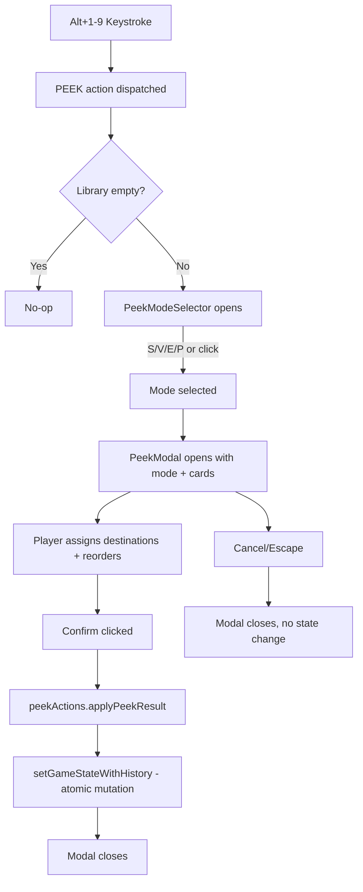

# Design Document: Peek Modal Upgrade

## Overview

This feature upgrades the existing read-only `PeekModal` into a multi-mode interactive card manipulation modal supporting Scry, Surveil, Select (Impulse/Dig), and plain Peek. Players can assign peeked cards to destination zones, reorder them within groups via @dnd-kit/sortable, and confirm changes atomically with undo support.

The feature touches these areas:
1. **`src/components/PeekModal.tsx`** — Complete rewrite: mode-aware UI with destination groups, drag reorder, confirm/cancel
2. **`src/components/PeekModeSelector.tsx`** — New component: intermediate mode picker shown before modal opens
3. **`src/peekActions.ts`** — New pure function module: applies peek confirmations to game state
4. **`src/App.tsx`** — Wire up mode selector → peek modal flow, replace current PEEK handler
5. **`src/hooks/useKeybinds.ts`** — No changes to action type (PEEK already dispatches count)
6. **`src/components/KeybindOverlay.tsx`** — Update peek shortcut description

## Architecture



**Data flow:**
1. `useKeybinds` dispatches `{ type: 'PEEK', count: N }`.
2. `App.tsx` handler opens `PeekModeSelector` with count N (instead of directly opening modal).
3. Player selects mode → `PeekModal` opens with `mode`, `cards` (top N from library), and `onConfirm` callback.
4. Inside `PeekModal`, local state tracks card assignments and ordering.
5. On confirm, `onConfirm(result)` is called. App.tsx applies `applyPeekResult(gameState, result)` via `setGameStateWithHistory`.

## Architecture Constraints (Reuse Existing Systems)

- **DndContext**: The app has a single `DndContext` in `AppShell` wrapping all content. The PeekModal renders inside AppShell's `overlay` slot, which is already within DndContext. **Do NOT create a nested DndContext** — just use `SortableContext` directly inside the modal.
- **SortableContext + horizontalListSortingStrategy**: Already used in `Battlefield.tsx` (RowTrack) and `HandTray.tsx` for reorder. The PeekModal will follow the same pattern — one `SortableContext` per destination group.
- **useSortable**: Standard dnd-kit sortable hook. PeekModal cards use a lightweight sortable wrapper (not `SortableCardWrapper` which carries battlefield-specific props like `rowId`, `isTapped`, `attachmentCount`). A simpler inline `useSortable` wrapper is appropriate here since peek cards have no rotation, docking, or tap state.
- **DragOverlay**: The existing `DragOverlay` in App.tsx handles all drag ghosts. The peek modal's sortable items can use the built-in dnd-kit displacement animation without needing a custom overlay — `SortableContext` handles "move aside" natively.
- **Collision detection**: `pointerWithin` is already configured in AppShell's DndContext sensors.

## Components and Interfaces

### PeekMode type

```typescript
// src/peekActions.ts
export type PeekMode = 'scry' | 'surveil' | 'select' | 'peek';
```

### PeekCardAssignment (local modal state)

```typescript
// src/components/PeekModal.tsx (internal)
interface PeekCardAssignment {
  card: CardData;
  destination: 'top' | 'bottom' | 'hand' | 'graveyard';
}
```

### PeekResult (passed to confirmation handler)

```typescript
// src/peekActions.ts
export interface PeekResult {
  mode: PeekMode;
  /** Cards assigned to top of library, in desired order (index 0 = top) */
  topCards: CardData[];
  /** Cards assigned to bottom of library, in desired order (index 0 = first on bottom) */
  bottomCards: CardData[];
  /** Cards assigned to hand */
  handCards: CardData[];
  /** Cards assigned to graveyard */
  graveyardCards: CardData[];
  /** Original card IDs that were peeked (for removal from library top) */
  originalCardIds: string[];
}
```

### applyPeekResult (pure state transform)

```typescript
// src/peekActions.ts
import type { GameState, CardData } from './types';

/**
 * Applies the result of a peek modal confirmation to game state.
 * Removes the peeked cards from the top of the library, then places them
 * in their assigned destinations.
 *
 * - topCards → prepended to library (index 0 = new top)
 * - bottomCards → appended to library end
 * - handCards → appended to hand array
 * - graveyardCards → prepended to graveyard array
 */
export function applyPeekResult(state: GameState, result: PeekResult): GameState {
  // Remove peeked cards from library top
  const remainingLibrary = state.library.filter(
    c => !result.originalCardIds.includes(c.id)
  );

  return {
    ...state,
    library: [...result.topCards, ...remainingLibrary, ...result.bottomCards],
    hand: [...state.hand, ...result.handCards],
    graveyard: [...result.graveyardCards, ...state.graveyard],
  };
}
```

### PeekModeSelector component

```typescript
// src/components/PeekModeSelector.tsx
export interface PeekModeSelectorProps {
  /** Number of cards to peek at */
  count: number;
  /** Whether the selector is open */
  isOpen: boolean;
  /** Called when a mode is selected */
  onSelectMode: (mode: PeekMode) => void;
  /** Called when dismissed without selection */
  onClose: () => void;
}
```

**Behavior:**
- Renders a small centered popup with 4 options: Scry, Surveil, Select, Peek
- Keyboard: Arrow Up/Down to highlight, Enter to confirm, or S/V/E/P shortcuts
- Escape or backdrop click dismisses
- Renders within upper 83.33vh

### PeekModal component (upgraded)

```typescript
// src/components/PeekModal.tsx
export interface PeekModalProps {
  /** Cards to manipulate (top N from library) */
  cards: CardData[];
  /** Active mode */
  mode: PeekMode;
  /** Whether the modal is open */
  isOpen: boolean;
  /** Called with result when player confirms */
  onConfirm: (result: PeekResult) => void;
  /** Called when cancelled (Escape, Cancel button, backdrop) */
  onClose: () => void;
}
```

**Internal state:**
- `assignments: PeekCardAssignment[]` — tracks each card's destination + ordering
- Initialized based on mode defaults (scry: all "top", surveil: all "top", select: all "bottom")
- Reordering via @dnd-kit/sortable within destination groups

**Rendering structure:**
```
┌─────────────────────────────────────────┐
│ Header: "Scry 3" / "Surveil 2" / etc.  │
├─────────────────────────────────────────┤
│ ┌─── Top of Library ────────────────┐   │
│ │ [Card1] [Card2]                   │   │
│ │  #1      #2                       │   │
│ └───────────────────────────────────┘   │
│                                         │
│ ┌─── Bottom of Library ─────────────┐   │
│ │ [Card3]                           │   │
│ │  #1                               │   │
│ └───────────────────────────────────┘   │
├─────────────────────────────────────────┤
│ [Cancel]                    [Confirm]   │
└─────────────────────────────────────────┘
```

**Card interaction:**
- Click a card → toggle its destination (scry: top↔bottom, surveil: top↔graveyard, select: bottom↔hand)
- Drag within a group → reorder (constrained to same destination)
- Arrow Left/Right → move focus, Space → toggle destination

### Destination zone colors

| Destination | Border Color | Badge |
|---|---|---|
| Top of Library | `border-blue-400` | 📚 Top |
| Bottom of Library | `border-amber-400` | ⬇ Bottom |
| Hand | `border-green-400` | ✋ Hand |
| Graveyard | `border-purple-400` | 💀 Graveyard |

### App.tsx integration changes

```typescript
// New state
const [showPeekModeSelector, setShowPeekModeSelector] = useState(false);
const [peekCount, setPeekCount] = useState(0);
const [peekMode, setPeekMode] = useState<PeekMode | null>(null);

// PEEK action handler (replaces current)
case 'PEEK': {
  const count = Math.min(action.count, gameState.library.length);
  if (count > 0 && !showPeekModal) {
    setPeekCount(count);
    setShowPeekModeSelector(true);
  }
  break;
}

// Mode selected → open modal
const handlePeekModeSelected = (mode: PeekMode) => {
  setShowPeekModeSelector(false);
  const cards = gameState.library.slice(0, peekCount);
  setPeekCards(cards);
  setPeekMode(mode);
  setShowPeekModal(true);
};

// Confirm handler
const handlePeekConfirm = (result: PeekResult) => {
  setGameState((prev: GameState) => applyPeekResult(prev, result));
  setShowPeekModal(false);
  setPeekMode(null);
};
```

## Data Models

### Mode behavior matrix

| Mode | Default Destination | Available Destinations | Reorderable Groups |
|---|---|---|---|
| Scry | top | top, bottom | top, bottom |
| Surveil | top | top, graveyard | top only |
| Select | bottom | hand, bottom | bottom only |
| Peek | — | — (read-only) | none |

### Destination assignment rules

| Action | Scry | Surveil | Select |
|---|---|---|---|
| Click card | top↔bottom | top↔graveyard | bottom↔hand |
| Space on focused | same as click | same as click | same as click |
| Default on open | all "top" | all "top" | all "bottom" |

## Correctness Properties

### Property 1: Card conservation

*For any* peek confirmation, the total number of cards in the result (topCards + bottomCards + handCards + graveyardCards) SHALL equal the number of originally peeked cards. No cards are created or destroyed.

**Validates: Requirements 3.5, 4.5, 5.5**

### Property 2: Library integrity

*For any* peek confirmation, the resulting library SHALL contain exactly: (topCards in order) + (original library minus peeked cards) + (bottomCards in order). No other library cards are affected.

**Validates: Requirements 3.5, 4.5, 5.5**

### Property 3: Single assignment

*For any* card in the peek modal, that card SHALL appear in exactly one destination group at all times. It cannot be unassigned or in multiple groups simultaneously.

**Validates: Requirements 6.7**

### Property 4: Atomic undo

*For any* peek confirmation, calling undo once SHALL restore the complete game state to its pre-confirmation snapshot (library, hand, and graveyard all revert).

**Validates: Requirements 6.2**

### Property 5: Cancel idempotency

*For any* cancel action (Escape, Cancel button, backdrop click), the game state SHALL be identical to the state before the peek modal opened. No partial mutations occur.

**Validates: Requirements 6.4, 6.5**

### Property 6: Mode constraint enforcement

*For any* mode, cards SHALL only be assignable to the destinations defined for that mode. Scry cards cannot go to hand or graveyard. Surveil cards cannot go to bottom or hand. Select cards cannot go to top or graveyard.

**Validates: Requirements 3.1, 4.1, 5.1**

### Property 7: Order preservation within groups

*For any* reorder operation within a destination group, only cards in that specific group SHALL change position. Cards in other groups SHALL maintain their relative order.

**Validates: Requirements 2.3, 3.4, 4.4, 5.4**

## Error Handling

| Scenario | Behavior |
|---|---|
| Library has fewer cards than requested N | Open with actual available count, display actual count in header |
| Library is empty when PEEK dispatched | No-op, mode selector does not open |
| PEEK triggered while modal already open | Ignored, existing modal maintains state |
| PEEK triggered while mode selector open | Update count, don't open duplicate |
| User confirms with 0 cards in a mode that expects placement | Valid — all cards go to the single available destination |

## Testing Strategy

### Unit Tests (vitest)

**`src/peekActions.test.ts`** — Pure function tests:
- `applyPeekResult` with all-top (scry keep all)
- `applyPeekResult` with mixed top/bottom (scry split)
- `applyPeekResult` with graveyard cards (surveil)
- `applyPeekResult` with hand cards (select)
- `applyPeekResult` with empty arrays (edge case)
- Card conservation: input count === output count across all zones
- Library ordering: topCards first, then remaining, then bottomCards

### Component Tests (vitest + testing-library)

**`src/components/PeekModal.test.tsx`**:
- Renders in each mode with correct header text
- Click toggles destination correctly per mode
- Confirm button disabled when cards have no valid assignment (shouldn't happen with defaults, but edge-guard)
- Confirm calls onConfirm with correct PeekResult structure
- Cancel/Escape calls onClose without onConfirm
- Peek mode: no confirm button, no drag handles, no click toggles

**`src/components/PeekModeSelector.test.tsx`**:
- Renders 4 mode options
- Keyboard navigation (arrow keys, Enter, letter shortcuts)
- Escape dismisses
- Calls onSelectMode with correct mode value

### Integration Tests (manual)

- Full flow: Alt+3 → select Scry → reorder → send 1 to bottom → confirm → verify library order
- Undo after confirm restores original library
- Surveil → graveyard cards appear on top of graveyard
- Select → hand cards appear in hand, rest on bottom
