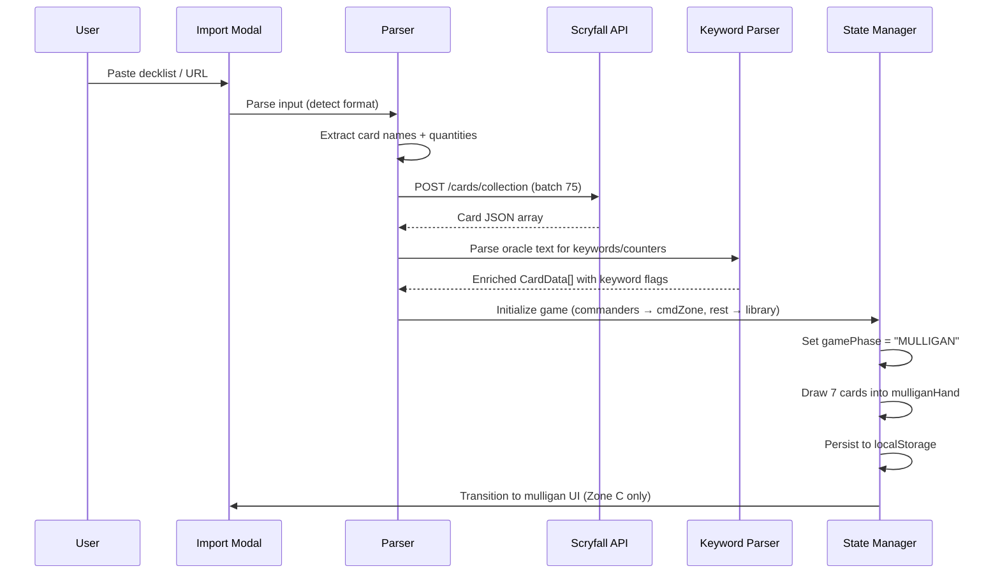
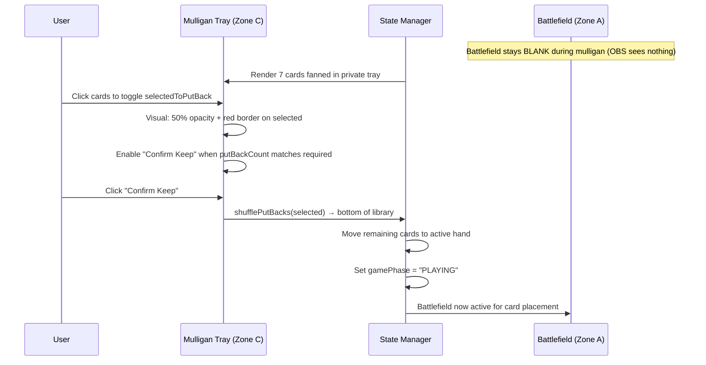
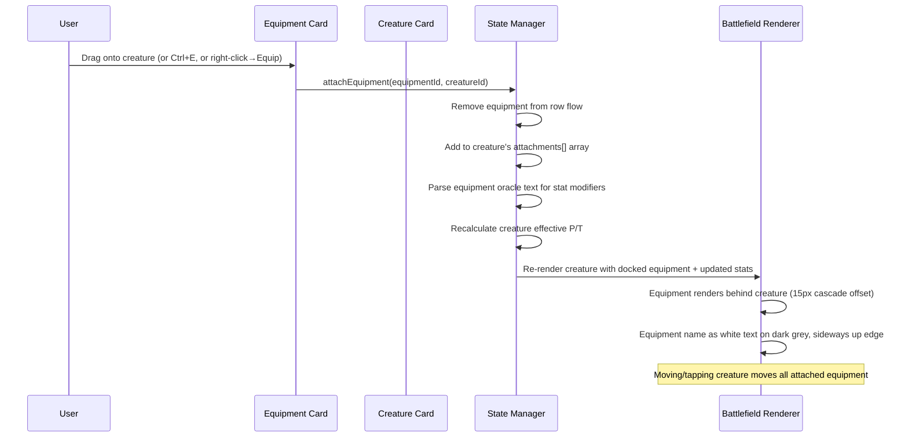
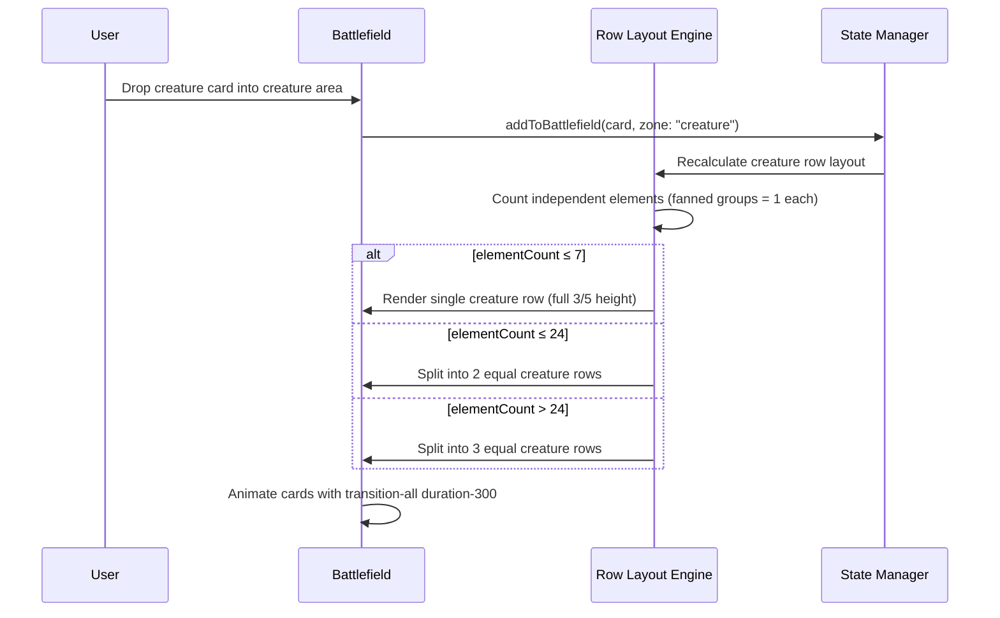

# Design Document: TCG Playmat — Continuous Flow Architecture

## Overview

TCG Playmat is a browser-based digital playmat for Magic: The Gathering designed for OBS-streamed Commander gameplay. The application renders a full-viewport interface divided into three strict zones: a continuous-flow battlefield (Zone A), a fixed-width card-stack sidebar (Zone B, ~150px), and a private hand tray (Zone C, bottom 16.67vh). The old static 4-row CSS Grid layout is eliminated entirely in favor of dynamic horizontal row tracks.

The battlefield uses a dynamic row system where cards flow freely within rows, stack with 95% horizontal overlap for same-name groups, and creature rows split dynamically (1→2→3) based on element count. Equipment and Auras dock behind their parent creatures with cascade offsets rather than occupying row flow positions. A mulligan engine renders exclusively within the private Zone C during game initialization.

The architecture enforces an "OBS Crop Invariant" — Zone C occupies the bottom 16.67vh (exactly 240px on a 1440p display) and is physically cropped from the stream. An HD Zoom Portal provides high-res card inspection positioned to the right of the hand tray, always below the OBS crop line.

The app uses React with Vite, Tailwind CSS, @dnd-kit for drag-and-drop, and localStorage persistence with debounced writes. Scryfall API provides card data with automatic keyword/counter parsing from oracle text.

## Architecture

```mermaid
graph TD
    subgraph Viewport ["Browser Viewport (100vw × 100vh)"]
        subgraph UpperRegion ["Upper Region (83.33vh) — grid: 1fr auto"]
            subgraph ZoneA ["Zone A — Battlefield (continuous flow)"]
                CR["Creature Area (3/5 height, 1-3 dynamic rows)"]
                PWCol["Planeswalker/Battle Column (far-right, conditional — only when present)"]
                R4["Row 3 (1/5): Basic/mana-only lands left L→R | Artifacts right R→L"]
                R5["Row 4 (1/5): Utility lands left L→R | Enchantments right R→L"]
                HUD["Hand Count HUD — bottom-left"]
            end
            subgraph ZoneB ["Zone B — Sidebar (1 card width, responsive)"]
                CMD["Command Zone (face-up)"]
                LIB["Library (face-down + count)"]
                GY["Graveyard (top face-up + count + delirium)"]
                EXL["Exile (count)"]
            end
        end
        subgraph ZoneC ["Zone C — Private Hand Tray (16.67vh, full width)"]
            Hand["Fan/Arc Hand Layout"]
            Mulligan["Mulligan UI (MULLIGAN phase only)"]
            HDZoom["HD Zoom Portal (right side)"]
        end
    end

    DeckImport["Deck Import: Paste / CSV / Moxfield / Archidekt"] -->|card names| ScryfallAPI["Scryfall API"]
    ScryfallAPI -->|CardData[] + oracle text| KeywordParser["Keyword/Counter Parser"]
    KeywordParser -->|enriched cards| GameState["Game State Manager"]
    GameState --> ZoneA
    GameState --> ZoneB
    GameState --> ZoneC
    GameState -->|debounced persist| LS["localStorage"]

    DnD["Drag & Drop Engine (@dnd-kit)"] --> ZoneA
    DnD --> ZoneB
    DnD --> ZoneC
    Keybinds["Keybind Engine (Archidekt-aligned)"] --> GameState
```

## Sequence Diagrams

### Deck Import & Game Initialization



### Mulligan Flow (Private Zone C Only)



### Equipment Docking Flow



### Dynamic Creature Row Splitting




## Components and Interfaces

### Component 1: AppShell

**Purpose**: Root layout enforcing 100vw × 100vh viewport. Splits into upper region (Zone A + Zone B at 83.33vh) and Zone C (16.67vh full width). Provides DragDropContext and global keybind listener.

**Interface**:
```typescript
interface AppShellProps {
  children?: React.ReactNode;
}

// Layout: Nested CSS Grid
// Outer grid: 2 rows
//   Row 1: 1fr (upper region = 83.33vh)
//   Row 2: var(--hand-tray-height) = 16.67vh
//
// Upper region inner grid: 2 columns
//   Col 1: 1fr (Zone A — Battlefield)
//   Col 2: var(--sidebar-width) (Zone B — Sidebar, one card width, scales with viewport)
//
// Zone C spans full width (both columns)
```

**Responsibilities**:
- Enforce viewport constraints (100vw × 100vh, overflow: hidden)
- Render upper region with Zone A and Zone B side-by-side
- Zone C spans full viewport width at the bottom
- Provide DndContext wrapper for cross-zone drag interactions
- Mount global keybind event listener at root level
- Mount HD Zoom Portal container (positioned in Zone C, right side)

### Component 2: Battlefield (Zone A)

**Purpose**: Continuous-flow battlefield with dynamic row system. No grid cells. Cards flow horizontally within rows and animate on position changes.

**Interface**:
```typescript
interface BattlefieldProps {
  creatureArea: CreatureArea;
  row3: SplitRow;               // Row 3: Basic/mana-only lands (left, L→R) + Artifacts (right, R→L)
  row4: SplitRow;               // Row 4: Utility lands (left, L→R) + Enchantments (right, R→L)
  handCount: number;
  gamePhase: GamePhase;
  onDropCard: (cardId: string, targetRow: RowTarget, insertIndex: number) => void;
  onTapCard: (cardId: string) => void;
  onAttachEquipment: (equipmentId: string, creatureId: string) => void;
  onMoveWithinRow: (cardId: string, targetRow: RowTarget, insertIndex: number) => void;
}

interface SplitRow {
  left: RowCard[];              // Lands — builds left-to-right
  right: RowCard[];             // Artifacts (Row 3) or Enchantments (Row 4) — builds right-to-left
}

type RowTarget =
  | 'creature-1' | 'creature-2' | 'creature-3'
  | 'row3-lands' | 'row3-artifacts'
  | 'row4-lands' | 'row4-enchantments'
  | 'pw-battle-column';
type GamePhase = 'MULLIGAN' | 'PLAYING';
```

**Row 3 & 4 Layout**:
- **Row 3** (1/5 height): Basic/mana-only lands on the left building L→R, Artifacts on the right building R→L
- **Row 4** (1/5 height): Utility lands on the left building L→R, Enchantments on the right building R→L
- Both sides grow toward center. The split is soft — if one side needs more space it can expand.

**Planeswalker/Battle Column**:
- A dedicated vertical column on the far-right of the creature area (adjacent to Zone B sidebar)
- Only rendered when at least one planeswalker or battle is on the battlefield
- Stacks planeswalkers/battles vertically, justified with creature rows
- When no planeswalkers/battles are present, the column is hidden and creatures get full width

**Responsibilities**:
- Render dynamic creature area (3/5 of battlefield height) with 1-3 rows
- Conditionally render planeswalker/battle column on far-right of creature area (only when present)
- Render Row 3 (1/5 height): basic/mana-only lands left L→R, artifacts right R→L
- Render Row 4 (1/5 height): utility lands left L→R, enchantments right R→L
- Cards within rows flow with smooth transitions (`transition-all duration-300 ease-in-out`)
- Same-name cards auto-fan with 95% horizontal overlap
- Accept card drops and insert at correct position within row
- Support drag-between-rows for creature row reassignment
- Render blank during MULLIGAN phase (OBS sees empty battlefield)
- Display hand count HUD at bottom-left, above crop line
- Must NOT extend into bottom 16.67vh

### Component 3: PublicStack (Zone B)

**Purpose**: Responsive-width sidebar on the RIGHT edge displaying 4 card-sized stacks vertically. Width scales with screen size (one card width). Styled like Archidekt/Moxfield playtest sidebars.

**Interface**:
```typescript
interface PublicStackProps {
  libraryCount: number;
  commandZone: CardData[];
  graveyard: CardData[];
  exile: ExileCard[];
  library: CardData[];
  deliriumCount: number;         // Unique card types in graveyard (0-9)
  onDropToZone: (cardId: string, zone: StackZone) => void;
  onDrawCard: () => void;
  onShuffle: () => void;
  onBrowseLibrary: () => void;
  onBrowseGraveyard: () => void;
}

type StackZone = 'commandZone' | 'graveyard' | 'library' | 'exile';

interface ExileCard {
  card: CardData;
  isFaceDown: boolean;
}
```

**Layout**:
- Width: responsive, scales with screen size (one card width — uses viewport-relative units, not fixed px)
- Height: spans from top of viewport to OBS crop line (83.33vh total), divided equally among 4 stacks
- Stacks arranged vertically: Command Zone → Library → Graveyard → Exile (top to bottom)
- Each stack occupies exactly 1/4 of the sidebar height (one card height per stack)

**Stack Display Rules**:
- **Command Zone**: Commander(s) face-up, stacked if multiple
- **Library**: Face-down card back with count badge (e.g., "52")
- **Graveyard**: Top card face-up with count badge + delirium count (e.g., "8 | D:4")
- **Exile**: Top card (face-up or face-down as appropriate) with count badge

**Delirium Calculation**:
```typescript
type DeliriumType = 'creature' | 'instant' | 'sorcery' | 'artifact' | 'enchantment' | 'planeswalker' | 'land' | 'tribal' | 'battle';

function calculateDelirium(graveyard: CardData[]): number {
  const DELIRIUM_TYPES: DeliriumType[] = [
    'creature', 'instant', 'sorcery', 'artifact',
    'enchantment', 'planeswalker', 'land', 'tribal', 'battle'
  ];
  const typesPresent = new Set<DeliriumType>();
  for (const card of graveyard) {
    const typeLine = card.typeLine.toLowerCase();
    for (const type of DELIRIUM_TYPES) {
      if (typeLine.includes(type)) {
        typesPresent.add(type);
      }
    }
  }
  return typesPresent.size; // 0-9
}
```

**Responsibilities**:
- Render Command Zone, Library, Graveyard, Exile as vertical card-sized stacks
- Each stack is a valid drop target for drag-and-drop
- Display card count badge on each stack
- Display delirium count on Graveyard stack (unique card types present, max 9)
- Provide Draw and Shuffle actions for Library (right-click or button)
- Must NOT extend below the OBS crop line (stays within upper 83.33vh)

### Component 4: RowTrack

**Purpose**: A single horizontal row track that renders cards in continuous flow. Handles fanning logic, drop targeting, and smooth repositioning animations.

**Interface**:
```typescript
interface RowTrackProps {
  rowId: RowTarget;
  elements: RowCard[];
  height: string;
  onDrop: (cardId: string, insertIndex: number) => void;
  onReorder: (cardId: string, newIndex: number) => void;
}
```

**Responsibilities**:
- Render cards left-to-right in flex-row layout
- Group same-name cards into fanned stacks (95% overlap)
- Animate card entry/exit/reposition with `transition-all duration-300 ease-in-out`
- Provide drop zones between cards for insertion
- When a card is dragged between two different-named cards/groups, visually open an animated gap at the hover position to preview insertion point
- If the dragged card is dropped next to a same-name card, it joins that fan group instead of inserting independently
- Players can freely reorder cards within any row to arrange strategic positioning (attackers, defenders, utility)
- Z-index management: sequential increment per card in fan (z-10, z-20, z-30...)

### Component 5: FannedGroup

**Purpose**: Renders a group of same-name cards with 95% horizontal overlap.

**Interface**:
```typescript
interface FannedGroupProps {
  cards: RowCard[];
  groupName: string;
  onCardClick: (cardId: string) => void;
  onDragStart: (cardId: string) => void;
}
```

**Responsibilities**:
- Stack cards with 95% horizontal offset (only 5% of underlying cards visible)
- Z-index increments sequentially (newest card on top, fully visible)
- Exposed 5% shows art banner, mana cost, tap state
- Entire group counts as 1 element for row capacity calculations

### Component 6: HandTray (Zone C)

**Purpose**: Private hand display below OBS crop. Also hosts mulligan UI and HD Zoom Portal.

**Interface**:
```typescript
interface HandTrayProps {
  cards: CardData[];
  gamePhase: GamePhase;
  mulliganState: MulliganState | null;
  hoveredCard: CardData | null;
  onDragStart: (cardId: string) => void;
  onToggleReveal: (cardId: string) => void;
  onMulliganAction: (action: MulliganAction) => void;
}

type MulliganAction =
  | { type: 'TOGGLE_PUT_BACK'; cardId: string }
  | { type: 'CONFIRM_KEEP' }
  | { type: 'MULLIGAN_AGAIN' };
```

**Responsibilities**:
- Render hand cards in fan/arc arrangement (PLAYING phase)
- Render mulligan UI exclusively within 16.67vh zone (MULLIGAN phase)
- Cards spread on hover for readability
- Height: 16.67vh, full viewport width
- Entire zone below OBS crop line
- When card count is manageable (≤~15), fan compresses/expands to fit without scrolling
- When card count exceeds readable threshold, enable horizontal scrolling via mouse scroll wheel
- Scrollbar is hidden visually (custom styled or overflow-x: auto with hidden scrollbar) to maintain clean appearance within Zone C
- Scroll wheel on the hand tray scrolls horizontally through the hand cards
- Host HD Zoom Portal to the right of hand cards

### Component 7: HDZoomPortal

**Purpose**: Absolute-positioned high-res card preview on hover. Within bottom 16.67vh zone (hidden from OBS).

**Interface**:
```typescript
interface HDZoomPortalProps {
  card: CardData | null;
  keywords: KeywordAbility[];
  counters: Counter[];
  attachments: CardData[];
}
```

**Responsibilities**:
- Show high-res card image on hover (any card on battlefield or in hand)
- Position: absolute, right side of Zone C area
- Must NEVER render above the OBS crop line
- Display parsed keyword abilities as visual badges
- Display counter values and attachment list

### Component 8: EquipmentDock

**Purpose**: Renders equipment/auras docked behind a creature with cascade offset. Automatically recalculates creature stats.

**Interface**:
```typescript
interface EquipmentDockProps {
  creature: RowCard;
  attachments: RowCard[];
  effectiveStats: EffectiveStats;
  onDetach: (equipmentId: string) => void;
}

interface StatModifier {
  power: number;
  toughness: number;
  source: string;  // equipment card ID
}

interface EffectiveStats {
  basePower: number;
  baseToughness: number;
  modifiedPower: number;
  modifiedToughness: number;
  modifiers: StatModifier[];
}
```

**Stat Auto-Calculation**:
```typescript
const STAT_MODIFIER_PATTERN = /(?:gets?|has)\s+([+-]\d+)\/([+-]\d+)/gi;

function calculateEffectiveStats(creature: RowCard, attachments: RowCard[]): EffectiveStats {
  const [basePower, baseToughness] = parseCreatureStats(creature.card.typeLine);
  const modifiers: StatModifier[] = [];

  for (const equip of attachments) {
    const matches = [...equip.card.oracleText.matchAll(STAT_MODIFIER_PATTERN)];
    let power = 0, toughness = 0;
    for (const match of matches) {
      power += parseInt(match[1], 10);
      toughness += parseInt(match[2], 10);
    }
    if (power !== 0 || toughness !== 0) {
      modifiers.push({ power, toughness, source: equip.card.id });
    }
  }

  return {
    basePower,
    baseToughness,
    modifiedPower: basePower + modifiers.reduce((s, m) => s + m.power, 0),
    modifiedToughness: baseToughness + modifiers.reduce((s, m) => s + m.toughness, 0),
    modifiers,
  };
}
```

**Responsibilities**:
- Render attached equipment behind creature with 15px cascade offset per attachment
- Display equipment card name as white text on dark grey background, rendered sideways
- Auto-calculate and display modified P/T on creature (e.g., "3/4 → 5/6")
- When equipment is detached, remove stat modifier and recalculate
- Moving/tapping creature moves all attached equipment in sync
- Equipment does NOT occupy row flow position when attached
- **Undock methods**: Right-click → "Detach", drag away from creature, or `Ctrl+E` toggle on hovered attachment
- **Expand to select**: Ctrl+click the creature's docked stack to fan out all attachments temporarily, allowing the player to see and interact with each one individually for undocking

### Component 9: MulliganTray

**Purpose**: Dedicated mulligan UI rendering exclusively within Zone C during MULLIGAN phase.

**Interface**:
```typescript
interface MulliganTrayProps {
  state: MulliganState;
  onTogglePutBack: (cardId: string) => void;
  onConfirmKeep: () => void;
  onMulliganAgain: () => void;
}
```

**Responsibilities**:
- Fan out drawn cards horizontally in private tray
- Click cards to toggle `selectedToPutBack` (50% opacity + red border)
- "Confirm Keep" disabled until exact put-back count selected
- First mulligan is free (put back = mulliganCount - 1)
- Entire UI renders ONLY within bottom 16.67vh
- Upper battlefield stays blank to OBS during mulligan

### Component 10: ContextMenu

**Purpose**: Right-click context menu for card interactions. Mirrors Archidekt's menu structure with our equip/unequip addition.

**Menu Structure (battlefield cards)**:
1. **Tap** (T)
2. **Move to →** submenu: Hand (H) | Graveyard (G) | Exile (E) | Command Zone | Top of library (Y) | Bottom of library (L) | X of library | Shuffle into library
3. **Card actions →** submenu: Flip/Transform (F) | Morph face-down (M) | Phase out (P) | Flip 180° (J)
4. **Add counters →** submenu: (full counter grid — see CounterType)
5. **Add / subtract power →** submenu: +1 / -1
6. **Add / subtract toughness →** submenu: +1 / -1
7. **Add / subtract +X/+X →** submenu: +1/+1 / -1/-1
8. **Equip / Attach to creature** (if equipment or aura)
9. **Detach from creature** (if currently docked)
10. **View card notes / details** (opens HD Zoom Portal in Zone C)
11. **Create token copy (C) →** submenu: 1 copy | 2 copies | 3 copies | ... | X copies (user enters number)
12. **Delete card from game** (red, with warning)

**Menu Items (hand cards)**:
- Play to Battlefield (B)
- Move to → Graveyard | Exile | Top of Library | Bottom of Library | Shuffle into library
- Reveal / Hide

**Menu Items (stack zone cards)**:
- Move to → Hand | Battlefield | other stack zones
- Flip face-down (Exile only)

**Responsibilities**:
- Render on right-click at cursor position
- Show keyboard shortcut hints next to applicable items (T, H, G, E, Y, L)
- Dismiss on click-away or Escape
- Adapt available options based on card zone and card type
- Counter submenu shows all counter types in a grid layout (matching Archidekt's counter panel)
- Custom counter allows user to name a new counter type

### Component 11: KeybindEngine

**Purpose**: Global keyboard shortcut handler modeled after Archidekt's playtest keybind system.

**Interface**:
```typescript
interface KeybindEngineProps {
  gameState: GameState;
  hoveredCardId: string | null;
  hoveredZone: Zone | null;
  selectedCardIds: string[];
  onAction: (action: GameAction) => void;
}
```

**Responsibilities**:
- Register global `keydown` event listener
- Detect modifier keys (Ctrl, Alt, Shift) for compound shortcuts
- Route key events to appropriate game actions
- Suppress keybinds when text input is focused
- Display keybind overlay when `?` is pressed
- Apply card actions to hovered card or all selected cards (multi-select)

## Keybind Reference (Archidekt-Aligned)

### Page Actions

| Key | Action |
|-----|--------|
| `?` | Show/hide keybind overlay |
| `N` | Next turn (untap all + draw) |
| `U` | Untap all |
| `D` | Draw a card |
| `Ctrl+G` | New game (soft reset with confirmation) |
| `Ctrl+S` | Shuffle library |
| `Ctrl+F` | Search/browse library |
| `Ctrl+Y` | Search/browse graveyard |
| `Ctrl+H` | View full hand (expand hand tray) |
| `Ctrl+A` | Select all battlefield cards |
| `Ctrl+Z` | Undo last action |
| `Ctrl+Shift+Z` | Redo last action |

### Quick Play (from hand)

| Key | Action |
|-----|--------|
| `1-9` | Play card N from hand to battlefield |

### Peek/Scry

| Key | Action |
|-----|--------|
| `Alt+1-9` | Peek top N cards from library |

### Move Card (hovered card)

| Key | Action |
|-----|--------|
| `B` | Move to battlefield |
| `H` | Move to hand |
| `G` | Move to graveyard |
| `E` | Move to exile |
| `Z` | Move to command zone |
| `Y` | Move to top of library |
| `L` | Move to bottom of library |

### Battlefield Card Actions (hovered card)

| Key | Action |
|-----|--------|
| `T` | Tap/untap |
| `F` | Flip/transform (DFC) |
| `M` | Morph (face-down toggle) |
| `P` | Phase (dim/undim) |
| `C` | Create token copy |
| `+` | Add +1/+1 counter |
| `-` | Remove counter |
| `Delete` | Delete from play (with caution warning) |

### Custom Additions

| Key | Action |
|-----|--------|
| `Ctrl+E` | Equip/attach to creature (enter equip mode) |
| `Spacebar` | Toggle reveal state of card in hand |

### Keybind Rules
- All keybinds disabled when focus is in `<input>`, `<textarea>`, or `[contenteditable]`
- Case-insensitive (works regardless of Caps Lock state)
- Card action keybinds apply to the card currently under the cursor (hovered)
- Multi-select: if action performed on a multi-selected card, applies to all selected cards

## Data Models

### CardData (Extended)

```typescript
interface CardData {
  id: string;                    // Unique instance ID (UUID v4)
  name: string;
  setCode: string;
  collectorNumber: string;
  imageURI: string;              // Front face image (normal size)
  imageURILarge: string;         // High-res image for HD Zoom Portal
  backFaceImageURI: string | null;
  typeLine: string;
  oracleText: string;
  isCommander: boolean;
  keywords: KeywordAbility[];    // Parsed from oracle text on import
  basePower: string | null;      // e.g. "3" or "*"
  baseToughness: string | null;
  cardType: CardType;            // Derived from typeLine for row assignment
}

type CardType = 'creature' | 'land' | 'artifact' | 'enchantment' | 'planeswalker' | 'instant' | 'sorcery' | 'battle' | 'other';

type KeywordAbility =
  | 'flying' | 'trample' | 'haste' | 'vigilance' | 'lifelink'
  | 'deathtouch' | 'hexproof' | 'indestructible' | 'menace'
  | 'reach' | 'first_strike' | 'double_strike' | 'flash'
  | 'defender' | 'ward' | 'shroud' | 'protection';
```

### RowCard (Battlefield Card)

```typescript
interface RowCard {
  card: CardData;
  instanceId: string;            // Same as card.id
  rowAssignment: RowTarget;
  positionIndex: number;         // Order within the row (left-to-right)
  isTapped: boolean;
  isFaceDown: boolean;
  showingBackFace: boolean;
  isPhased: boolean;             // Dimmed when phased out
  attachments: Attachment[];     // Equipment/Auras docked to this card
  counters: Counter[];
  isRevealed: boolean;           // Spacebar toggle for hand cards
}

interface Attachment {
  card: CardData;
  instanceId: string;
  isTapped: boolean;             // Inherits tap state from parent
}

interface Counter {
  type: CounterType;
  value: number;
}

type CounterType =
  | '+1/+1' | '-1/-1'
  | 'lifelink' | 'hexproof' | 'indestructible' | 'shroud'
  | 'time' | 'charge' | 'generic' | 'loyalty'
  | 'flying' | 'deathtouch' | 'menace' | 'trample'
  | 'first_strike' | 'double_strike' | 'reach'
  | 'vigilance' | 'token' | 'lore' | 'shield' | 'haste'
  | 'custom';
```

### GameState (Refactored)

```typescript
interface GameState {
  gamePhase: GamePhase;

  // Battlefield — continuous flow rows
  creatureArea: CreatureArea;
  row3: SplitRow;               // Lands (left) + Artifacts (right)
  row4: SplitRow;               // Lands (left) + Enchantments (right)

  // Off-battlefield zones
  hand: CardData[];
  commandZone: CardData[];
  graveyard: CardData[];
  library: CardData[];
  exile: ExileCard[];

  // Mulligan state (null when not in MULLIGAN phase)
  mulliganState: MulliganState | null;

  // Metadata
  deckLoaded: boolean;
  lifeTotal: number;             // Commander: 40
}

type GamePhase = 'MULLIGAN' | 'PLAYING';

interface CreatureArea {
  rows: CreatureRow[];           // 1-3 rows, dynamically managed
  totalElementCount: number;     // Cached count for split decisions
}

interface CreatureRow {
  id: string;                    // 'creature-1', 'creature-2', 'creature-3'
  elements: RowCard[];
}

interface MulliganState {
  mulliganCount: number;
  drawnCards: CardData[];
  selectedToPutBack: Set<string>;
  requiredPutBacks: number;      // max(0, mulliganCount - 1) — first is free
}

interface ExileCard {
  card: CardData;
  isFaceDown: boolean;
}
```

### KeywordDictionary

```typescript
const KEYWORD_PATTERNS: Record<KeywordAbility, RegExp> = {
  flying: /\bflying\b/i,
  trample: /\btrample\b/i,
  haste: /\bhaste\b/i,
  vigilance: /\bvigilance\b/i,
  lifelink: /\blifelink\b/i,
  deathtouch: /\bdeathtouch\b/i,
  hexproof: /\bhexproof\b/i,
  indestructible: /\bindestructible\b/i,
  menace: /\bmenace\b/i,
  reach: /\breach\b/i,
  first_strike: /\bfirst strike\b/i,
  double_strike: /\bdouble strike\b/i,
  flash: /\bflash\b/i,
  defender: /\bdefender\b/i,
  ward: /\bward\b/i,
  shroud: /\bshroud\b/i,
  protection: /\bprotection\b/i,
};
```

## Algorithmic Pseudocode

### Dynamic Creature Row Splitting

```typescript
function recalculateCreatureRows(creatureArea: CreatureArea): CreatureArea {
  const allElements = creatureArea.rows.flatMap(r => r.elements);
  const elementCount = countIndependentElements(allElements);

  let targetRowCount: number;
  if (elementCount <= 7) targetRowCount = 1;
  else if (elementCount <= 24) targetRowCount = 2;
  else targetRowCount = 3;

  const currentRowCount = creatureArea.rows.length;
  if (targetRowCount === currentRowCount) {
    return { ...creatureArea, totalElementCount: elementCount };
  }

  if (targetRowCount > currentRowCount) {
    // SPLIT: Add new empty rows
    const newRows = [...creatureArea.rows];
    while (newRows.length < targetRowCount) {
      newRows.push({ id: `creature-${newRows.length + 1}`, elements: [] });
    }
    return { rows: newRows, totalElementCount: elementCount };
  }

  // MERGE: Collapse rows into remaining
  const keptRows = creatureArea.rows.slice(0, targetRowCount);
  const removedElements = creatureArea.rows.slice(targetRowCount).flatMap(r => r.elements);
  keptRows[keptRows.length - 1].elements.push(...removedElements);
  return { rows: keptRows, totalElementCount: elementCount };
}

function countIndependentElements(elements: RowCard[]): number {
  // Fanned groups (same name) count as 1 element
  const uniqueNames = new Set(elements.map(el => el.card.name));
  return uniqueNames.size;
}
```

### Equipment Docking

```typescript
function attachEquipment(state: GameState, equipmentId: string, creatureId: string): GameState {
  // Remove equipment from its current row
  const { equipment, stateAfterRemoval } = removeFromRow(state, equipmentId);

  // Attach to creature
  const updatedState = mapCreatureRows(stateAfterRemoval, (rowCard) => {
    if (rowCard.instanceId === creatureId) {
      return {
        ...rowCard,
        attachments: [...rowCard.attachments, {
          card: equipment.card,
          instanceId: equipment.instanceId,
          isTapped: false,
        }],
      };
    }
    return rowCard;
  });

  // Recalculate row layout (element removed from flow)
  return { ...updatedState, creatureArea: recalculateCreatureRows(updatedState.creatureArea) };
}
```

### Mulligan Engine

```typescript
function initializeMulligan(state: GameState): GameState {
  const drawnCards = state.library.slice(0, 7);
  const remainingLibrary = state.library.slice(7);
  return {
    ...state,
    gamePhase: 'MULLIGAN',
    library: remainingLibrary,
    mulliganState: {
      mulliganCount: 0,
      drawnCards,
      selectedToPutBack: new Set(),
      requiredPutBacks: 0,  // First hand: keep all 7
    },
  };
}

function mulliganAgain(state: GameState): GameState {
  const { mulliganState } = state;
  const returnedLibrary = [...state.library, ...mulliganState!.drawnCards];
  const shuffledLibrary = fisherYatesShuffle(returnedLibrary);
  const newDrawn = shuffledLibrary.slice(0, 7);
  const newLibrary = shuffledLibrary.slice(7);
  const newMulliganCount = mulliganState!.mulliganCount + 1;

  return {
    ...state,
    library: newLibrary,
    mulliganState: {
      mulliganCount: newMulliganCount,
      drawnCards: newDrawn,
      selectedToPutBack: new Set(),
      requiredPutBacks: Math.max(0, newMulliganCount - 1),
    },
  };
}

function confirmKeep(state: GameState): GameState {
  const { mulliganState } = state;
  const putBackIds = mulliganState!.selectedToPutBack;
  const keptCards = mulliganState!.drawnCards.filter(c => !putBackIds.has(c.id));
  const putBackCards = mulliganState!.drawnCards.filter(c => putBackIds.has(c.id));

  return {
    ...state,
    gamePhase: 'PLAYING',
    hand: keptCards,
    library: [...state.library, ...putBackCards],
    mulliganState: null,
  };
}
```

### Card Fanning Layout

```typescript
function computeFanLayout(elements: RowCard[]): FanGroup[] {
  const groups = new Map<string, RowCard[]>();
  for (const el of elements) {
    if (!groups.has(el.card.name)) groups.set(el.card.name, []);
    groups.get(el.card.name)!.push(el);
  }

  const CARD_WIDTH = 130;
  const OVERLAP_RATIO = 0.95;
  const EXPOSED_WIDTH = CARD_WIDTH * (1 - OVERLAP_RATIO); // 6.5px

  const fanGroups: FanGroup[] = [];
  let currentX = 0;

  for (const [name, cards] of groups) {
    fanGroups.push({
      name,
      cards,
      startX: currentX,
      totalWidth: CARD_WIDTH + (cards.length - 1) * EXPOSED_WIDTH,
      zIndexBase: fanGroups.length * 10,
    });
    currentX += CARD_WIDTH + (cards.length - 1) * EXPOSED_WIDTH + 8;
  }
  return fanGroups;
}

interface FanGroup {
  name: string;
  cards: RowCard[];
  startX: number;
  totalWidth: number;
  zIndexBase: number;
}
```

### Soft Reset (Updated)

```typescript
function softReset(state: GameState): GameState {
  // Collect ALL cards from all zones (including attachments)
  const allCards: CardData[] = [
    ...state.hand,
    ...state.creatureArea.rows.flatMap(r =>
      r.elements.flatMap(el => [el.card, ...el.attachments.map(a => a.card)])
    ),
    ...state.row3.left.flatMap(el => [el.card, ...el.attachments.map(a => a.card)]),
    ...state.row3.right.flatMap(el => [el.card, ...el.attachments.map(a => a.card)]),
    ...state.row4.left.flatMap(el => [el.card, ...el.attachments.map(a => a.card)]),
    ...state.row4.right.flatMap(el => [el.card, ...el.attachments.map(a => a.card)]),
    ...state.commandZone,
    ...state.graveyard,
    ...state.library,
    ...state.exile.map(ec => ec.card),
    ...(state.mulliganState?.drawnCards ?? []),
  ];

  const commanders = allCards.filter(c => c.isCommander);
  const mainboard = allCards.filter(c => !c.isCommander);

  return {
    gamePhase: 'MULLIGAN',
    creatureArea: { rows: [{ id: 'creature-1', elements: [] }], totalElementCount: 0 },
    row3: { left: [], right: [] },
    row4: { left: [], right: [] },
    hand: [],
    commandZone: commanders,
    graveyard: [],
    library: mainboard,
    exile: [],
    mulliganState: null,
    deckLoaded: true,
    lifeTotal: 40,
  };
}
```

### Untap All

```typescript
function untapAll(state: GameState): GameState {
  const untapRow = (elements: RowCard[]): RowCard[] =>
    elements.map(el => ({
      ...el,
      isTapped: false,
      attachments: el.attachments.map(a => ({ ...a, isTapped: false })),
    }));

  return {
    ...state,
    creatureArea: {
      ...state.creatureArea,
      rows: state.creatureArea.rows.map(row => ({
        ...row,
        elements: untapRow(row.elements),
      })),
    },
    row3: { left: untapRow(state.row3.left), right: untapRow(state.row3.right) },
    row4: { left: untapRow(state.row4.left), right: untapRow(state.row4.right) },
  };
}
```

## Correctness Properties

*A property is a characteristic or behavior that should hold true across all valid executions of a system — essentially, a formal statement about what the system should do. Properties serve as the bridge between human-readable specifications and machine-verifiable correctness guarantees.*

### Property 1: Zone Exclusivity

*For any* game state, each card ID appears in exactly one location (hand, battlefield row, attachment slot, commandZone, graveyard, library, exile, or mulliganState.drawnCards). Moves between zones are atomic.

**Validates: Requirements 22.4**

### Property 2: Card Count Conservation

*For any* state transition (move, reset, mulligan, draw, shuffle), the total card count across all zones remains constant. No cards are created or destroyed by any game action (except explicit token creation or deletion).

**Validates: Requirements 25.6, 28.4**

### Property 3: OBS Crop Invariant

*For any* game state, Zone C exists entirely below the OBS crop boundary (bottom 16.67vh). No UI from Zone A or Zone B renders within this region. During MULLIGAN phase, mulligan UI renders exclusively within Zone C. HD Zoom Portal never renders above the crop line.

**Validates: Requirements 2.2, 2.3, 10.3, 10.4, 11.2, 11.3**

### Property 4: State Persistence Round-Trip

*For any* valid GameState s, `deserialize(serialize(s)) ≡ s` (modulo Set→Array conversion for selectedToPutBack). All zone contents, tap states, counter values, docking relationships, and face-down states survive the round-trip.

**Validates: Requirements 23.1, 23.2, 26.5, 27.4, 17.6**

### Property 5: Soft Reset Correctness

*For any* game state, after softReset: commanders are in Command Zone, mainboard cards are in Library, all other zones (hand, battlefield, graveyard, exile) are empty, all tap/counter/attachment states are cleared, and gamePhase = MULLIGAN.

**Validates: Requirements 25.1, 25.2, 25.3, 25.4**

### Property 6: Creature Row Capacity

*For any* creature area element count: if count ≤ 7 then rows.length === 1; if 7 < count ≤ 24 then rows.length === 2; if count > 24 then rows.length === 3. Row count is never 0 or greater than 3.

**Validates: Requirements 5.2, 5.3, 5.4**

### Property 7: Fanned Group Invariant

*For any* Row_Track, cards with the same name form exactly one Fanned_Group. Each Fanned_Group counts as 1 element for capacity calculations. Only cards with identical names are fanned together.

**Validates: Requirements 8.1, 8.5, 8.6, 5.5**

### Property 8: Fanning Z-Index Ordering

*For any* Fanned_Group with N cards, z-index of card[i] < z-index of card[i+1] for all 0 ≤ i < N-1. The newest card is fully visible on top.

**Validates: Requirements 8.4**

### Property 9: Equipment Docking Isolation

*For any* docked equipment, it does NOT appear in any Row_Track element flow. Moving or tapping the parent creature propagates to all attachments, maintaining the 15px cascade offset relationship.

**Validates: Requirements 9.1, 9.7**

### Property 10: Equipment Stat Modifier Additivity

*For any* creature with docked equipment, effective power = base power + sum of all docked equipment power modifiers, and effective toughness = base toughness + sum of all docked equipment toughness modifiers. Docking adds exactly that equipment's modifier; undocking removes exactly that equipment's modifier.

**Validates: Requirements 9.8, 9.9**

### Property 11: Mulligan Put-Back Formula

*For any* mulligan count N, requiredPutBacks = max(0, N - 1). The first mulligan is free. "Confirm Keep" is disabled until selectedToPutBack.size === requiredPutBacks.

**Validates: Requirements 11.7, 11.8, 11.10**

### Property 12: Mulligan Card Conservation

*For any* mulligan or keep action, the total card count across library + mulliganState.drawnCards + hand remains constant. No cards are lost or duplicated during the mulligan process.

**Validates: Requirements 11.6, 11.11**

### Property 13: Mulligan Privacy Invariant

*For any* state where gamePhase === 'MULLIGAN', all battlefield zones (creature rows, Row 3, Row 4) are empty. The mulligan UI renders exclusively within Zone C. OBS captures only a blank battlefield.

**Validates: Requirements 11.2, 11.3**

### Property 14: Schema Conformance

*For any* card imported from Scryfall: it has a unique UUID v4 id, non-empty name, lowercase 3-5 character setCode, valid HTTPS imageURI, and non-empty typeLine. Quantity prefixes produce that many separate instances each with a unique ID.

**Validates: Requirements 20.1, 20.2, 20.4, 20.5**

### Property 15: Rate Limit Compliance

*For any* sequence of Scryfall API requests, the time between consecutive requests is ≥ 50ms. Each batch request contains ≤ 75 card identifiers.

**Validates: Requirements 21.1, 21.2**

### Property 16: Invalid Drop No-Op

*For any* card dropped outside a valid zone, the game state remains unchanged and the card stays in its source position.

**Validates: Requirements 22.5, 29.2**

### Property 17: No Page Refresh Invariant

*For any* state transition or error condition, no `window.location.reload()` or navigation event fires. The React component tree stays mounted and OBS capture remains uninterrupted.

**Validates: Requirements 24.1, 24.4**

### Property 18: Draw Correctness

*For any* non-empty library, a draw action moves exactly the top card to the hand. Library length decreases by 1, hand length increases by 1, total card count is unchanged. For an empty library, draw is a no-op.

**Validates: Requirements 28.1, 28.2**

### Property 19: Shuffle Preservation

*For any* library, shuffle produces a permutation of the same cards. No cards are added or removed. The set of card IDs before and after shuffle is identical.

**Validates: Requirements 28.3, 28.4**

### Property 20: Keyword Parsing Completeness

*For any* card with recognized keyword abilities in its oracle text, the parser detects and returns all matching keywords from the defined keyword dictionary.

**Validates: Requirements 18.1**

### Property 21: Counter Arithmetic

*For any* card with a counter of value V, incrementing produces V+1 and decrementing produces V-1. Counter values persist across state saves (covered by Property 4).

**Validates: Requirements 17.3**

### Property 22: Untap All Completeness

*For any* game state, after untapAll every card on the battlefield has isTapped === false, including all docked attachments.

**Validates: Requirements 26.4**

### Property 23: Tap Toggle Idempotence

*For any* card on the battlefield, toggling tap twice returns the card to its original tap state (tap(tap(s)) === s).

**Validates: Requirements 26.1**

### Property 24: Delirium Count Accuracy

*For any* graveyard contents, the delirium count equals the number of unique MTG card types (creature, instant, sorcery, artifact, enchantment, planeswalker, land, tribal, battle) present. The range is always 0-9.

**Validates: Requirements 13.1, 13.2, 13.3, 13.4**

### Property 25: Keybind Input Isolation

*For any* keyboard event fired while focus is in a text input, textarea, or contenteditable element, no game keybind action is triggered.

**Validates: Requirements 15.26**

### Property 26: Row Insertion Ordering

*For any* Row_Track, cards are ordered left-to-right by positionIndex. Insertion at position P shifts all cards at positions ≥ P to the right by one.

**Validates: Requirements 4.2, 4.5**

### Property 27: API Error State Isolation

*For any* API error (Scryfall unreachable, invalid URL, timeout), the existing game state remains unchanged and uncorrupted.

**Validates: Requirements 29.5**

### Property 28: DFC Transform Toggle

*For any* double-faced card, transforming toggles between imageURI and backFaceImageURI. Transforming twice returns to the original face. Face-down cards display a generic card back.

**Validates: Requirements 27.1, 27.2**

### Property 29: Card Type Row Assignment

*For any* card placed on the battlefield, its row assignment is determined by card type: creatures go to the Creature_Area, basic/mana-only lands go to Row 3 left, utility lands go to Row 4 left, artifacts go to Row 3 right, enchantments go to Row 4 right, and planeswalkers/battles go to the PW_Battle_Column.

**Validates: Requirements 6.1, 6.2, 6.3, 6.4, 6.5**

### Property 30: Planeswalker/Battle Column Visibility

*For any* game state, the PW_Battle_Column is rendered if and only if at least one planeswalker or battle exists on the battlefield. When no planeswalkers or battles are present, the column is hidden.

**Validates: Requirements 7.1, 7.3, 7.4**

### Property 31: Hand Count HUD Accuracy

*For any* game state, the displayed hand count equals the number of cards in Zone_C (hand.length). After any card movement involving the hand, the displayed count reflects the new hand size.

**Validates: Requirements 30.1, 30.2**

### Property 32: Corrupted State Recovery

*For any* invalid or malformed JSON input to the state deserializer, the system initializes with empty state without crashing or throwing an unhandled exception.

**Validates: Requirements 23.4**

## Error Handling

| Scenario | Condition | Response | Recovery |
|----------|-----------|----------|----------|
| Scryfall Unavailable | Network failure during import | Error toast + retry option | User retries; existing state intact |
| Partial Import Failure | Some cards not found | Import succeeds for found cards; list failures | User corrects names or continues |
| Invalid Drop | Card dropped outside valid zone | Snap back with animation; no state change | Automatic |
| Equipment on Non-Creature | Attach to land/enchantment | Reject; toast "Can only equip creatures" | Automatic |
| Mulligan Insufficient Library | Library < 7 cards | Draw available cards; adjust putBacks | Game continues with reduced hand |
| localStorage Quota | QuotaExceededError | Warning toast; continue in-memory | User informed |
| Corrupted State | JSON parse failure on load | Initialize fresh empty state | Automatic |
| Moxfield/Archidekt Down | URL invalid/private/unreachable | Error message; 10s timeout | Retry or paste fallback |
| DFC Image Resolution | card_faces instead of image_uris | Use card_faces[0]/[1] | Automatic in mapToCardData() |

## Testing Strategy

### Property-Based Testing (fast-check)
- Zone Exclusivity: any action sequence → each card in exactly one location
- Card Conservation: any action sequence → total count constant
- Row Capacity: any creature area mutation → row count matches thresholds
- Fan Counting: countIndependentElements = number of unique card names
- Mulligan Put-Back: requiredPutBacks = max(0, mulliganCount - 1)
- Equipment Binding: after attach → not in row; after detach → in row
- Soft Reset Idempotency: softReset(softReset(s)) ≡ softReset(s)
- Persistence Round-Trip: deserialize(serialize(s)) ≡ s
- Untap All: after untapAll → no card has isTapped === true
- Delirium: count matches unique types in graveyard

### Integration Testing
- Full drag-and-drop from hand to battlefield row
- Equipment docking via drag, Ctrl+E, and right-click
- Mulligan flow end-to-end (draw → select → confirm → playing)
- Dynamic row splitting with progressive card additions
- HD Zoom Portal stays within Zone C bounds
- Keybind system with all registered shortcuts
- State persistence across tab close/reopen

## Performance Considerations

- **Smooth Transitions**: `transition-all duration-300 ease-in-out transform` for GPU-accelerated animations
- **Fan Layout Memoization**: `computeFanLayout()` memoized via useMemo, recomputed only on element change
- **Row Splitting Debounce**: 100ms debounce to avoid rapid oscillation near thresholds
- **Scryfall Rate Limiting**: ≥50ms between requests, batch via /cards/collection (75/request)
- **Image Loading**: Lazy-load; `normal` size for battlefield, `large` for HD Zoom Portal
- **State Management**: useReducer for batched transitions, single dispatch per action
- **localStorage Writes**: Debounced at 100ms
- **Keyword Parsing**: Parse once on import, cache in CardData
- **Drag Performance**: @dnd-kit uses CSS transforms (no DOM cloning)

## Security Considerations

- All Scryfall requests over HTTPS (no API key required)
- External URLs (Moxfield/Archidekt) validated before fetch, HTTPS only
- No sensitive data in localStorage (card metadata only)
- XSS Prevention: card names/oracle text rendered as text content, never innerHTML
- CSP: `img-src` restricted to `https://cards.scryfall.io`
- Input validation: deck import text sanitized, no eval()

## Dependencies

- **React 18+**: UI framework with hooks and useReducer
- **Vite**: Build tooling and dev server
- **Tailwind CSS**: Utility-first styling (transitions, transforms, layout)
- **@dnd-kit/core + @dnd-kit/sortable**: Drag-and-drop (lightweight, accessible, sortable lists)
- **Scryfall API**: External card data source (raw fetch with rate limiting)
- **crypto.randomUUID()**: Built-in browser API for card instance IDs
- **fast-check**: Property-based testing (dev dependency)
- **vitest**: Test runner (dev dependency)
