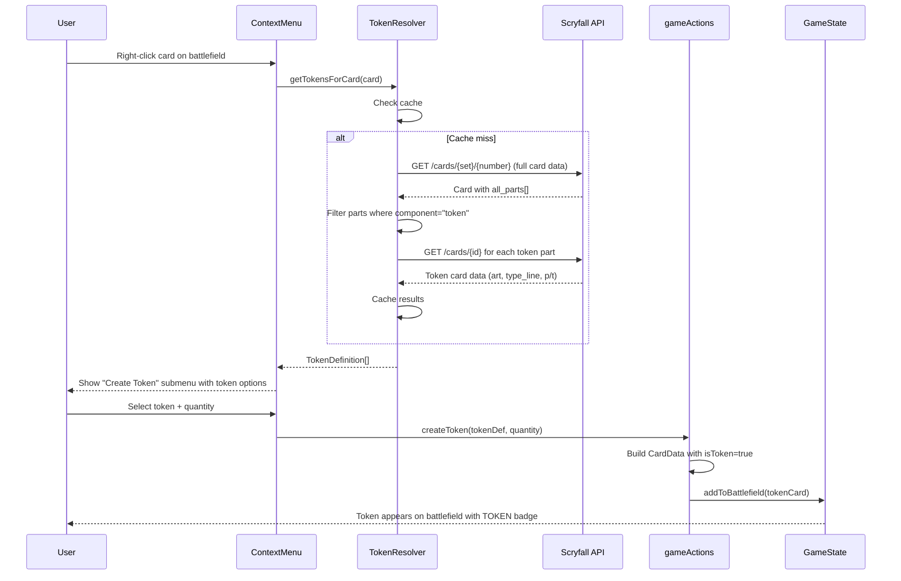
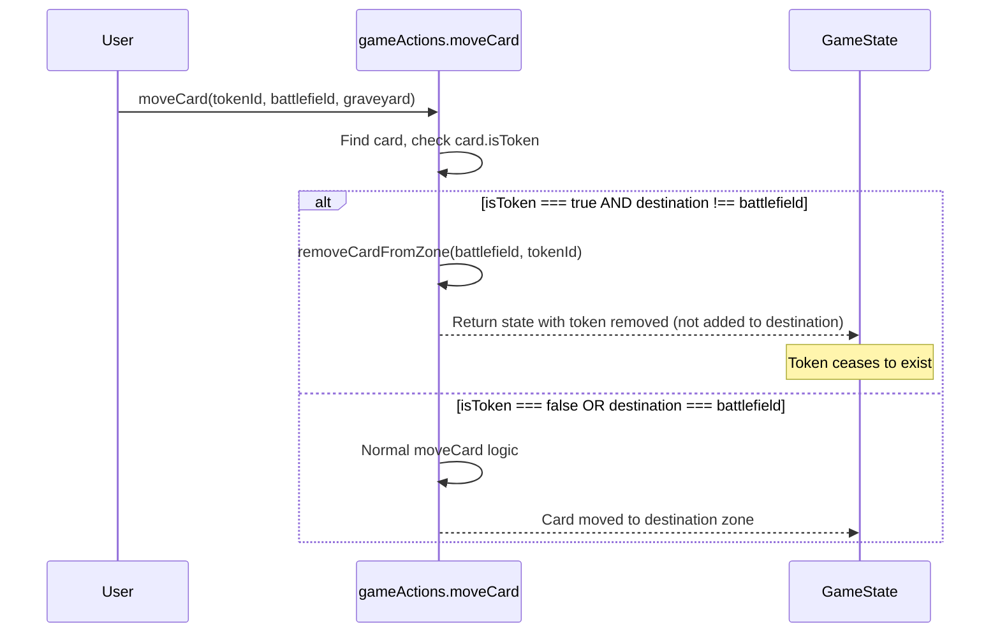
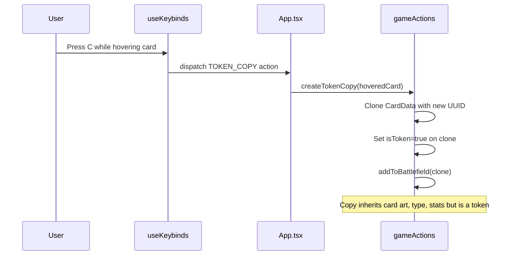

# Design Document: Token System

## Overview

The Token System adds full token creature support to the TCG Playmat application. Tokens are ephemeral game objects that exist only on the battlefield — when moved to any other zone (graveyard, exile, hand, library, command zone), they cease to exist entirely and are deleted from game state rather than being placed in the destination zone.

The system integrates with the Scryfall API's `all_parts` data to resolve token art and metadata for cards that produce tokens. Users create tokens via a context menu "Create Token" action (with quantity selector) on cards that have associated token data, or via the existing TOKEN_COPY keybind (C key). Token copies (C key) display a visual "TOKEN" overlay badge since they reuse the original card's art and would otherwise be indistinguishable from the real card. Tokens created from Scryfall token art do NOT need the badge — they already have distinct token art and "Token Creature" type lines.

Key design decisions:
- Tokens are represented as regular `CardData` objects with `isToken: true`, reusing the existing battlefield rendering pipeline
- The `moveCard` function intercepts token zone transitions and performs deletion instead of movement
- Token metadata is fetched from Scryfall's `all_parts` array (entries with `component: "token"`) and cached per card
- The TOKEN_COPY keybind creates copies marked as tokens with `isTokenCopy: true` (triggers TOKEN badge)
- Scryfall-sourced tokens have `isToken: true` but `isTokenCopy: false` (no badge needed — art is already distinct)

## Architecture

```mermaid
graph TD
    subgraph "Data Layer"
        SF[Scryfall API] -->|all_parts with component=token| TR[Token Resolver]
        TR -->|TokenDefinition[]| TC[Token Cache]
    end

    subgraph "State Layer"
        GA[gameActions.ts] -->|moveCard intercept| TD[Token Deletion Logic]
        GA -->|createToken| BF[Battlefield State]
        TC -->|token CardData| GA
    end

    subgraph "UI Layer"
        CM[ContextMenu] -->|Create Token action| GA
        KB[useKeybinds - C key] -->|TOKEN_COPY| GA
        DC[DraggableCard] -->|renders TOKEN badge| VIS[Visual Overlay]
        BF --> DC
    end
```

## Sequence Diagrams

### Token Creation via Context Menu



### Token Deletion on Zone Change



### Token Copy via Keybind



## Components and Interfaces

### Component 1: Token Resolver (`src/api/tokenResolver.ts`)

**Purpose**: Fetches and caches token definitions from Scryfall's `all_parts` data for cards that produce tokens.

**Interface**:
```typescript
interface TokenPart {
  id: string;
  component: 'token';
  name: string;
  uri: string;
}

interface TokenDefinition {
  /** Scryfall card ID for the token */
  scryfallId: string;
  /** Token name (e.g., "Knight") */
  name: string;
  /** Full type line (e.g., "Token Creature — Human Knight") */
  typeLine: string;
  /** Power (e.g., "2") */
  power: string | null;
  /** Toughness (e.g., "2") */
  toughness: string | null;
  /** Token art image URL */
  imageURI: string;
  /** High-res token art */
  imageURILarge: string;
  /** Set code of the token printing */
  setCode: string;
  /** Collector number of the token printing */
  collectorNumber: string;
  /** Oracle text of the token (abilities) */
  oracleText: string;
  /** Derived card type */
  cardType: CardType;
  /** Keywords on the token */
  keywords: KeywordAbility[];
}

interface TokenResolverAPI {
  /** Fetches token definitions for a card. Returns empty array if card produces no tokens. */
  getTokensForCard(card: CardData): Promise<TokenDefinition[]>;
  /** Checks if a card has associated tokens (cache-only, no network). */
  hasTokensCached(card: CardData): boolean;
  /** Clears the token cache. */
  clearCache(): void;
}
```

**Responsibilities**:
- Fetch full card data from Scryfall to access `all_parts` array
- Filter `all_parts` entries where `component === "token"`
- Resolve each token part URI to get full token card data (art, stats, type)
- Cache results keyed by `${setCode}/${collectorNumber}` to avoid redundant API calls
- Respect Scryfall rate limiting (50ms between requests)

### Component 2: Token Game Actions (`src/gameActions.ts` additions)

**Purpose**: Pure functions for token creation, token-aware movement, and token copy logic.

**Interface**:
```typescript
/** Creates a token CardData from a TokenDefinition */
function createTokenCardData(tokenDef: TokenDefinition): CardData;

/** Creates N token copies on the battlefield from a TokenDefinition */
function createTokens(
  state: GameState,
  tokenDef: TokenDefinition,
  quantity: number
): GameState;

/** Creates a token copy of an existing battlefield card */
function createTokenCopy(state: GameState, sourceCardId: string): GameState;

/** Token-aware moveCard — deletes tokens instead of moving them off battlefield */
function moveCard(
  state: GameState,
  cardId: string,
  from: Zone,
  to: Zone,
  targetRow?: RowTarget
): GameState;
```

**Responsibilities**:
- Generate token `CardData` with `isToken: true` and unique UUIDs
- Intercept `moveCard` when source is `battlefield` and card `isToken === true` — delete instead of move to non-battlefield zones
- Handle TOKEN_COPY keybind by cloning the hovered card's data with `isToken: true`

### Component 3: Context Menu Token UI (`src/components/ContextMenu.tsx` additions)

**Purpose**: Adds "Create Token" submenu to the context menu for cards with associated tokens.

**Interface**:
```typescript
/** New context menu action type */
type ContextMenuAction =
  | /* ...existing actions... */
  | { type: 'CREATE_TOKEN'; tokenDef: TokenDefinition; quantity: number };

/** Additional props needed */
interface ContextMenuProps {
  /* ...existing props... */
  /** Available token definitions for the right-clicked card (empty if none) */
  availableTokens: TokenDefinition[];
}
```

**Responsibilities**:
- Display "Create Token" menu item only when `availableTokens.length > 0`
- Show submenu with each available token (name, P/T preview)
- Include quantity selector (1-10, default 1)
- Dispatch `CREATE_TOKEN` action with selected token definition and quantity

### Component 4: Token Visual Overlay (`src/components/DraggableCard.tsx` modification)

**Purpose**: Renders a "TOKEN" badge overlay on token copies (C key) to distinguish them from real cards.

**Responsibilities**:
- Check `card.isTokenCopy` flag on the rendered CardData
- Render a semi-transparent overlay badge reading "TOKEN" in the top-left corner ONLY for token copies
- Scryfall-sourced tokens (with their own distinct art) do NOT get the badge
- Badge should be visible but not obscure card art significantly
- Badge persists regardless of tap/flip/phase state

## Data Models

### Extended CardData Interface

```typescript
interface CardData {
  /** ...all existing fields... */

  /** True if this card is a token (ephemeral, deleted on zone exit) */
  isToken: boolean;
  /** True if this is a token COPY (C key) — shows TOKEN badge since it uses original art */
  isTokenCopy: boolean;
}
```

**Validation Rules**:
- `isToken` defaults to `false` for all cards created via deck import
- `isToken` is `true` for all cards created via token creation or TOKEN_COPY
- `isTokenCopy` is `true` ONLY for copies made via C key (not for Scryfall-sourced tokens)
- `isTokenCopy` implies `isToken` (all copies are tokens, but not all tokens are copies)
- Both fields are immutable after creation
- TOKEN badge renders only when `isTokenCopy === true`

### Token Cache Structure

```typescript
/** In-memory cache for resolved token definitions */
type TokenCache = Map<string, TokenDefinition[]>;
// Key format: "${setCode}/${collectorNumber}"
// Value: array of token definitions (a card may produce multiple different tokens)
```

**Validation Rules**:
- Cache key uses lowercase setCode
- Cache is cleared on New Game / deck reimport
- Cache entries are never stale within a session (Scryfall data is static per printing)

### Scryfall `all_parts` Response Shape

```typescript
/** Relevant subset of Scryfall card response for token resolution */
interface ScryfallCardFull {
  all_parts?: Array<{
    object: 'related_card';
    id: string;
    component: 'token' | 'meld_part' | 'meld_result' | 'combo_piece';
    name: string;
    type_line: string;
    uri: string;
  }>;
}
```

## Algorithmic Pseudocode

### Token-Aware Move Card Algorithm

```typescript
function moveCard(
  state: GameState,
  cardId: string,
  from: Zone,
  to: Zone,
  targetRow?: RowTarget
): GameState {
  // ASSERT: cardId exists in `from` zone
  // ASSERT: from !== to (unless battlefield-to-battlefield reposition)

  // Token interception: tokens leaving battlefield are deleted, not moved
  if (from === 'battlefield' && to !== 'battlefield') {
    const found = findCardOnBattlefield(state, cardId);
    if (found && found.card.card.isToken) {
      // Token ceases to exist — just remove from battlefield, don't add anywhere
      const { newState } = removeCardFromZone(state, 'battlefield', cardId);
      return newState;
    }
  }

  // ...existing moveCard logic unchanged for non-tokens...
}
```

**Preconditions:**
- `cardId` exists in the `from` zone
- `from` and `to` are valid Zone values

**Postconditions:**
- If card is a token AND moving off battlefield: card is deleted from game state entirely
- If card is not a token: normal move behavior (card appears in destination zone)
- Total non-token card count across all zones remains unchanged

**Loop Invariants:** N/A (no loops in this function)

### Token Creation Algorithm

```typescript
function createTokens(
  state: GameState,
  tokenDef: TokenDefinition,
  quantity: number
): GameState {
  // ASSERT: quantity >= 1 && quantity <= 10
  // ASSERT: tokenDef contains valid card data

  let currentState = state;

  for (let i = 0; i < quantity; i++) {
    // INVARIANT: i tokens have been added to battlefield
    const tokenCard: CardData = {
      id: crypto.randomUUID(),
      name: tokenDef.name,
      setCode: tokenDef.setCode,
      collectorNumber: tokenDef.collectorNumber,
      imageURI: tokenDef.imageURI,
      imageURILarge: tokenDef.imageURILarge,
      backFaceImageURI: null,
      backFaceCardType: null,
      typeLine: tokenDef.typeLine,
      oracleText: tokenDef.oracleText,
      isCommander: false,
      basePower: tokenDef.power,
      baseToughness: tokenDef.toughness,
      cardType: tokenDef.cardType,
      keywords: tokenDef.keywords,
      isToken: true,
    };

    currentState = addToBattlefield(currentState, tokenCard);
  }

  // ASSERT: battlefield has `quantity` more cards than before, all with isToken=true
  return currentState;
}
```

**Preconditions:**
- `quantity` is a positive integer between 1 and 10
- `tokenDef` contains all required fields for CardData construction

**Postconditions:**
- Exactly `quantity` new token cards added to battlefield
- Each token has a unique UUID
- Each token has `isToken === true`
- Tokens are placed in the correct row based on their `cardType`

**Loop Invariants:**
- After iteration `i`: exactly `i` tokens have been added to the battlefield
- All previously added tokens remain in their assigned positions

### Token Copy Algorithm

```typescript
function createTokenCopy(state: GameState, sourceCardId: string): GameState {
  // ASSERT: sourceCardId exists on the battlefield

  const found = findCardOnBattlefield(state, sourceCardId);
  if (!found) return state;

  const sourceCard = found.card.card;

  const tokenCopy: CardData = {
    ...sourceCard,
    id: crypto.randomUUID(),
    isToken: true,
    isCommander: false, // Token copies are never commanders
  };

  return addToBattlefield(state, tokenCopy);
}
```

**Preconditions:**
- `sourceCardId` exists on the battlefield

**Postconditions:**
- A new card with `isToken: true` is added to the battlefield
- The copy shares all visual/stat properties of the source (name, art, type, P/T)
- The copy has a unique ID distinct from the source
- The source card is unchanged

**Loop Invariants:** N/A

### Token Resolution Algorithm

```typescript
async function getTokensForCard(card: CardData): Promise<TokenDefinition[]> {
  const cacheKey = `${card.setCode}/${card.collectorNumber}`;

  // Check cache first
  if (tokenCache.has(cacheKey)) {
    return tokenCache.get(cacheKey)!;
  }

  // Fetch full card data from Scryfall (includes all_parts)
  const scryfallUrl = `/api/scryfall/cards/${card.setCode}/${card.collectorNumber}`;
  const response = await fetch(scryfallUrl);
  if (!response.ok) {
    tokenCache.set(cacheKey, []);
    return [];
  }

  const fullCard = await response.json();

  // Filter for token parts
  const tokenParts = (fullCard.all_parts ?? [])
    .filter((part: any) => part.component === 'token');

  if (tokenParts.length === 0) {
    tokenCache.set(cacheKey, []);
    return [];
  }

  // Resolve each token part to full card data
  const tokenDefs: TokenDefinition[] = [];
  for (const part of tokenParts) {
    // INVARIANT: all previously resolved tokens are valid TokenDefinitions
    await delay(50); // Rate limiting
    const tokenResponse = await fetch(`/api/scryfall/cards/${part.id}`);
    if (!tokenResponse.ok) continue;

    const tokenCard = await tokenResponse.json();
    tokenDefs.push(mapScryfallToTokenDef(tokenCard));
  }

  tokenCache.set(cacheKey, tokenDefs);
  return tokenDefs;
}
```

**Preconditions:**
- `card.setCode` and `card.collectorNumber` are valid Scryfall identifiers
- Network is available (graceful degradation if not)

**Postconditions:**
- Returns array of `TokenDefinition` objects (may be empty)
- Result is cached for subsequent calls with same card
- Scryfall rate limit respected (50ms between requests)

**Loop Invariants:**
- All previously resolved token parts are valid and stored in `tokenDefs`
- Rate limit delay applied before each API call

## Key Functions with Formal Specifications

### Function: moveCard (token-aware)

```typescript
function moveCard(
  state: GameState,
  cardId: string,
  from: Zone,
  to: Zone,
  targetRow?: RowTarget
): GameState
```

**Preconditions:**
- `cardId` exists in zone `from`
- `from !== to` (unless both are `battlefield` for repositioning)

**Postconditions:**
- If `card.isToken && from === 'battlefield' && to !== 'battlefield'`:
  - Card is removed from battlefield
  - Card is NOT added to any destination zone
  - Card ceases to exist in game state
- Else: existing moveCard behavior (card transferred from `from` to `to`)

### Function: createTokens

```typescript
function createTokens(
  state: GameState,
  tokenDef: TokenDefinition,
  quantity: number
): GameState
```

**Preconditions:**
- `1 <= quantity <= 10`
- `tokenDef` has all required fields populated

**Postconditions:**
- `getAllBattlefieldCards(result).length === getAllBattlefieldCards(state).length + quantity`
- All new cards have `isToken === true`
- All new cards have unique IDs
- All new cards are placed in the correct row for their `cardType`

### Function: createTokenCopy

```typescript
function createTokenCopy(state: GameState, sourceCardId: string): GameState
```

**Preconditions:**
- `sourceCardId` exists on the battlefield

**Postconditions:**
- Battlefield has exactly one more card than before
- New card has `isToken === true`
- New card has same `name`, `imageURI`, `typeLine`, `cardType` as source
- New card has different `id` from source
- Source card is unchanged

### Function: getTokensForCard

```typescript
async function getTokensForCard(card: CardData): Promise<TokenDefinition[]>
```

**Preconditions:**
- `card.setCode` is a valid Scryfall set code
- `card.collectorNumber` is a valid collector number within that set

**Postconditions:**
- Returns `TokenDefinition[]` (empty if card produces no tokens)
- Result is deterministic for same input (cached)
- No side effects beyond cache population
- Scryfall rate limit respected

## Example Usage

```typescript
// Example 1: Creating tokens from a card's token definitions
const knightTokenDef: TokenDefinition = {
  scryfallId: 'abc-123',
  name: 'Knight',
  typeLine: 'Token Creature — Human Knight',
  power: '2',
  toughness: '2',
  imageURI: 'https://cards.scryfall.io/normal/front/...',
  imageURILarge: 'https://cards.scryfall.io/large/front/...',
  setCode: 'eld',
  collectorNumber: '10',
  oracleText: '',
  cardType: 'creature',
  keywords: [],
};

const newState = createTokens(gameState, knightTokenDef, 2);
// Result: 2 Knight tokens on battlefield, each with isToken=true

// Example 2: Token copy via C keybind
const stateAfterCopy = createTokenCopy(gameState, hoveredCardId);
// Result: clone of hovered card on battlefield with isToken=true

// Example 3: Token deletion on zone change
const stateAfterMove = moveCard(gameState, tokenId, 'battlefield', 'graveyard');
// Result: token removed from battlefield, NOT added to graveyard

// Example 4: Context menu integration
const tokens = await getTokensForCard(selectedCard);
if (tokens.length > 0) {
  // Show "Create Token" submenu with token options
  showTokenSubmenu(tokens);
}

// Example 5: Rendering token badge in DraggableCard
function DraggableCard({ card }: { card: CardData }) {
  return (
    <div className="relative">
      
      {card.isToken && (
        <div className="absolute top-1 left-1 bg-black/70 text-white text-xs px-1.5 py-0.5 rounded font-bold">
          TOKEN
        </div>
      )}
    </div>
  );
}
```

## Correctness Properties

The following properties must hold for all valid game states:

### Property 1: Token Ephemerality

For all cards `c` where `c.isToken === true`, `c` can only exist in the `battlefield` zone. If a token is found in `hand`, `graveyard`, `library`, `exile`, or `commandZone`, the state is invalid.

### Property 2: Token Creation Purity

`createTokens(state, def, n)` adds exactly `n` cards to the battlefield, all with `isToken === true`, and does not modify any other zone.

### Property 3: Token Deletion on Move

For any `moveCard(state, id, 'battlefield', dest)` where `dest !== 'battlefield'` and the card at `id` has `isToken === true`: the resulting state has one fewer card total (the token is destroyed, not relocated).

### Property 4: Non-Token Preservation

`moveCard` for cards with `isToken === false` behaves identically to the existing implementation — no tokens are created or destroyed as a side effect.

### Property 5: Token Copy Identity

`createTokenCopy(state, sourceId)` produces a card with a different `id` than `sourceId` but identical visual properties (`name`, `imageURI`, `typeLine`, `cardType`).

### Property 6: Cache Idempotency

`getTokensForCard(card)` returns the same result on repeated calls for the same card (deterministic after first resolution).

### Property 7: isToken Immutability

Once a `CardData` is created with `isToken: true`, no game action can change it to `isToken: false`, and vice versa.

## Error Handling

### Error Scenario 1: Scryfall API Failure During Token Resolution

**Condition**: Network error or non-200 response when fetching card's `all_parts` data
**Response**: Return empty `TokenDefinition[]` — card simply shows no "Create Token" option
**Recovery**: Cache empty result; user can retry by re-opening context menu (cache miss on next session)

### Error Scenario 2: Token Part URI Resolution Failure

**Condition**: Individual token part fetch fails (e.g., token card removed from Scryfall)
**Response**: Skip that token part, continue resolving others
**Recovery**: Partial results cached; available tokens still shown in menu

### Error Scenario 3: Token Creation with Invalid State

**Condition**: `createTokens` called with `quantity <= 0` or missing token definition fields
**Response**: Return state unchanged (no-op)
**Recovery**: UI validates quantity input (min=1, max=10) before dispatching action

### Error Scenario 4: Token Copy of Non-Existent Card

**Condition**: `createTokenCopy` called with `sourceCardId` not found on battlefield
**Response**: Return state unchanged (no-op)
**Recovery**: Keybind only fires when `hoveredCardId` is set and card is on battlefield

### Error Scenario 5: Persistence of Tokens Across Sessions

**Condition**: Game state with tokens is saved to localStorage and restored
**Response**: Tokens persist normally (they're valid CardData with `isToken: true`)
**Recovery**: On New Game, all tokens are cleared along with all other cards during soft reset

## Testing Strategy

### Unit Testing Approach

- Test `createTokens` produces correct number of cards with `isToken: true`
- Test `createTokenCopy` clones card data correctly with new ID
- Test `moveCard` deletes tokens when moving off battlefield
- Test `moveCard` preserves normal behavior for non-token cards
- Test `getTokensForCard` returns correct definitions from mocked Scryfall responses
- Test token cache hit/miss behavior
- Test `mapScryfallToTokenDef` correctly maps Scryfall token card data

### Property-Based Testing Approach

**Property Test Library**: fast-check

Key properties to test:
- **Token ephemerality**: For any sequence of `moveCard` operations, no token ever appears in a non-battlefield zone
- **Token count conservation**: `createTokens(state, def, n)` always increases battlefield count by exactly `n`
- **Non-token invariance**: Any `moveCard` on a non-token card produces the same result regardless of whether other tokens exist on the battlefield
- **Token deletion is total**: After `moveCard(state, tokenId, battlefield, anyOtherZone)`, the token ID does not appear anywhere in the resulting state

### Integration Testing Approach

- End-to-end test: right-click card → "Create Token" → verify token appears on battlefield with badge
- End-to-end test: press C on hovered card → verify token copy appears
- End-to-end test: drag token to graveyard → verify token disappears (not in graveyard)
- Visual regression: TOKEN badge renders correctly at various card sizes

## Performance Considerations

- **Token resolution caching**: Scryfall API calls are cached per card (set/collector number key) to avoid redundant network requests. A card's token data never changes, so cache is valid for the entire session.
- **Batch creation**: Creating multiple tokens (quantity > 1) iterates sequentially through `addToBattlefield` — this is acceptable since max quantity is 10 and each add is O(n) where n is battlefield card count.
- **No persistence overhead**: Tokens are stored as regular `CardData` in state, so localStorage serialization handles them identically to real cards with no additional cost.
- **Lazy resolution**: Token definitions are only fetched when the user right-clicks a card (not on deck import), avoiding unnecessary API calls for cards the user never interacts with.

## Security Considerations

- **API proxy**: All Scryfall requests go through the Vite dev server proxy (`/api/scryfall/`) to avoid CORS issues. No user credentials are sent.
- **Input validation**: Quantity selector is bounded (1-10) in the UI. `createTokens` validates quantity before processing.
- **UUID generation**: Token IDs use `crypto.randomUUID()` — collision probability is negligible.
- **No injection risk**: Token names and text come from Scryfall (trusted source) and are rendered as text content, not innerHTML.

## Dependencies

- **Scryfall API** (`/cards/{set}/{number}` endpoint): Required for `all_parts` token resolution. Already proxied via Vite config.
- **Scryfall API** (`/cards/{id}` endpoint): Required for resolving individual token card data from part URIs.
- **crypto.randomUUID()**: Browser API for generating unique token instance IDs (already used throughout the app).
- **Existing modules**: `gameActions.ts` (moveCard, addToBattlefield, removeCardFromZone), `mapToCardData.ts` (deriveCardType), `types.ts` (CardData, Zone, RowTarget).
